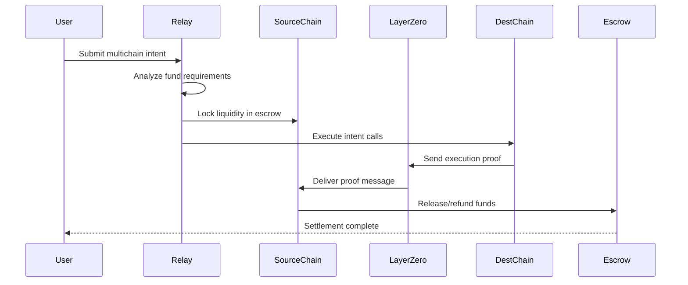
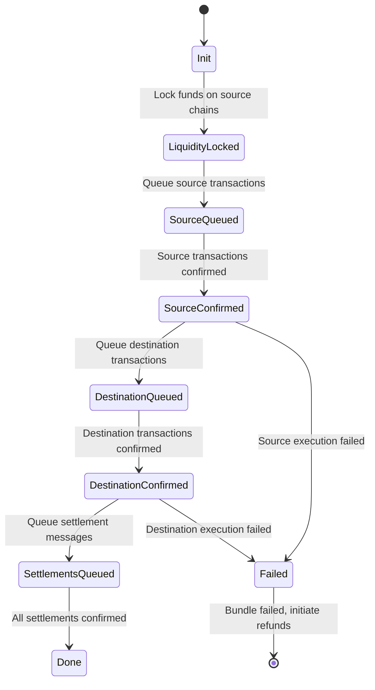
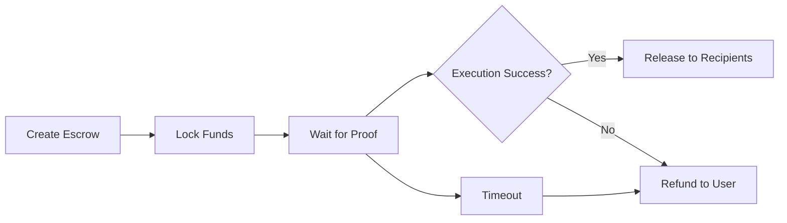

# Cross-Chain Operations

The Ithaca Relay provides atomic cross-chain execution for EIP-7702 accounts through intelligent fund sourcing and LayerZero-based settlement.

## Overview

Cross-chain intents allow users to execute operations across multiple blockchains atomically - either all chains succeed or all fail. The relay handles:

- **Fund sourcing** across multiple chains
- **Atomic execution** with rollback on failure  
- **Settlement messaging** via LayerZero
- **State synchronization** between chains

## Cross-Chain Intent Flow



## Bundle State Machine

**Implementation**: `src/transactions/interop.rs`

Cross-chain bundles progress through these states:



### State Definitions

- **`Init`**: Bundle created, validation complete
- **`LiquidityLocked`**: Funds locked in escrow contracts
- **`SourceQueued`**: Source chain transactions submitted
- **`SourceConfirmed`**: Source execution confirmed on-chain
- **`DestinationQueued`**: Destination transactions submitted
- **`DestinationConfirmed`**: Destination execution confirmed
- **`SettlementsQueued`**: LayerZero settlement messages sent
- **`Done`**: All operations complete, funds settled

## Fund Sourcing Algorithm

**Implementation**: `src/rpc/relay.rs`

The relay automatically determines optimal fund sourcing:

```rust
// Simplified fund sourcing logic
pub enum FundingStrategy {
    SingleChain,          // All funds available on execution chain
    MultiChain {          // Funds sourced from multiple chains
        sources: Vec<FundSource>,
        total_required: U256,
    },
}

pub struct FundSource {
    pub chain_id: ChainId,
    pub token: Address,
    pub amount: U256,
    pub escrow_address: Address,
}
```

### Sourcing Priority

1. **Execution chain**: Check if sufficient funds exist locally
2. **Connected chains**: Find funds on chains with established escrows
3. **Optimization**: Minimize number of source chains
4. **Cost analysis**: Factor in gas costs and settlement fees

## LayerZero Integration

**Implementation**: `src/interop/settler/layerzero/`

### Message Types

```rust
pub enum SettlementMessage {
    ExecutionProof {
        bundle_id: B256,
        execution_hash: B256,
        success: bool,
    },
    RefundRequest {
        bundle_id: B256,
        escrow_address: Address,
        reason: RefundReason,
    },
}
```

### Settlement Flow

1. **Message Dispatch**: Relay sends proof via LayerZero
2. **Cross-Chain Delivery**: LayerZero validates and delivers message
3. **Settlement Execution**: Destination contract processes settlement
4. **Fund Release**: Escrow releases funds to final recipients

## Escrow Contracts

**Implementation**: `src/types/escrow.rs`

### Escrow Lifecycle



### Key Functions

- **`lockFunds()`**: Lock user funds pending execution
- **`executeSettlement()`**: Process LayerZero settlement message
- **`refund()`**: Return funds if execution fails
- **`emergencyWithdraw()`**: Admin function for emergency recovery

## Error Handling

### Failure Scenarios

| Failure Type | Recovery Action | User Impact |
|--------------|----------------|-------------|
| Source execution fails | Immediate refund | Funds returned, no fees charged |
| Destination execution fails | Refund via LayerZero | Funds returned, gas fees lost |
| LayerZero message fails | Manual intervention | Support team assistance |
| Timeout exceeded | Automatic refund | Funds returned after delay |

### Automatic Recovery

**Implementation**: `src/interop/refund/`

- **Timeout handling**: Automatic refunds after configured timeout
- **Retry logic**: Retry failed LayerZero messages
- **State reconciliation**: Periodic state synchronization
- **Manual intervention**: Support tools for edge cases

## Configuration

### Cross-Chain Settings

```yaml
interop:
  enabled: true
  timeout: 300  # 5 minutes
  max_source_chains: 3
  layerzero:
    endpoint: "0x..." # LayerZero endpoint address
    chain_mapping:
      1: 101     # Ethereum -> LayerZero chain ID
      137: 109   # Polygon -> LayerZero chain ID
  escrow:
    factory: "0x..."  # Escrow factory contract
    salt_prefix: "ithaca_relay"
```

### Fee Configuration

```yaml
chain:
  interop_tokens:
    - address: "0x..." # USDC
      chains: [1, 137, 42161]  # Ethereum, Polygon, Arbitrum
    - address: "0x..." # USDT  
      chains: [1, 56, 43114]   # Ethereum, BSC, Avalanche
```

## Monitoring and Metrics

### Key Metrics

- **Bundle success rate**: Percentage of successful cross-chain bundles
- **Settlement latency**: Time from execution to settlement
- **Fund utilization**: Efficiency of fund sourcing
- **LayerZero message costs**: Cross-chain messaging expenses

### Monitoring Tools

**Implementation**: `src/metrics/interop.rs`

```rust
// Example metrics
counter!("interop.bundles.created");
counter!("interop.bundles.completed");
counter!("interop.bundles.failed");
histogram!("interop.settlement.latency");
gauge!("interop.escrow.locked_funds");
```

## Development and Testing

### Local Testing

```bash
# Run multichain tests
cargo test multichain --features e2e

# Start local LayerZero mock
cd tests/e2e/layerzero
forge script DeployMocks
```

### E2E Test Patterns

**Implementation**: `tests/e2e/cases/multichain_usdt_transfer.rs`

- **Fund sourcing scenarios**: Test various fund distribution patterns
- **Failure injection**: Test failure handling and refunds  
- **LayerZero simulation**: Mock cross-chain message delivery
- **State consistency**: Verify atomic execution guarantees

## Security Considerations

### Attack Vectors

1. **MEV extraction**: Front-running cross-chain arbitrage
2. **Bridge exploits**: LayerZero message manipulation
3. **Escrow drain**: Malicious settlement messages
4. **DoS attacks**: Spam cross-chain intents

### Mitigations

- **Intent validation**: Strict validation of cross-chain intents
- **Rate limiting**: Limit cross-chain operations per account
- **Escrow security**: Multi-sig and timelock protections
- **Message verification**: Cryptographic proof validation

---

## Related Documentation

- **[Transaction Pipeline](transaction-pipeline.md)** - End-to-end transaction processing
- **[Storage Layer](storage-layer.md)** - Bundle state persistence
- **[RPC Endpoints](rpc-endpoints.md)** - Cross-chain intent API