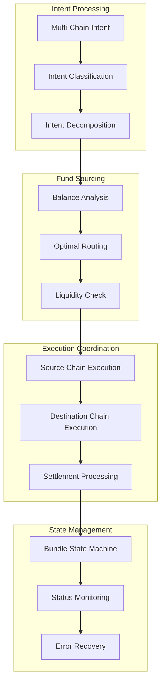
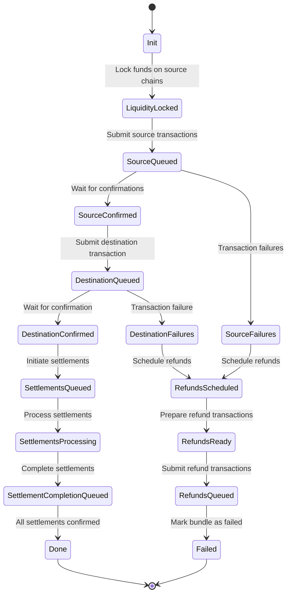

# Cross-Chain Operations Architecture

This document details the relay's sophisticated cross-chain coordination system that enables atomic multi-chain intent execution with automatic fund sourcing and settlement guarantees.

## Cross-Chain System Overview



## Multi-Chain Intent Detection

### Intent Classification

**Implementation**: `src/types/intent.rs`

The relay detects multi-chain intents through nonce prefix analysis:

```rust
/// Nonce prefix to signal multi-chain execution
pub const MULTICHAIN_NONCE_PREFIX: U256 = uint!(0xc1d0_U256);

impl SignedCalls for Intent {
    fn is_multichain(&self) -> bool {
        self.nonce() >> 240 == MULTICHAIN_NONCE_PREFIX
    }
}
```

**Detection Criteria**:
- **Nonce prefix**: Upper 16 bits contain `0xc1d0`
- **Fund requirements**: Intent requires more assets than available on target chain
- **Explicit marking**: SDK explicitly marks intent as multi-chain

### Intent Decomposition

**Implementation**: `src/types/intent.rs`

Multi-chain intents are decomposed into constituent parts:

```rust
#[derive(Debug, Clone)]
pub enum IntentKind {
    Single,                    // Standard single-chain intent
    MultiOutput {              // Final execution on destination chain
        leaf_index: usize,
        fund_transfers: Vec<(Address, U256)>,
        settler_context: Bytes,
    },
    MultiInput {               // Fund sourcing on source chains
        leaf_info: MerkleLeafInfo,
        fee: Option<(Address, U256)>,
    },
}
```

**Decomposition Process**:
1. **Analyze Requirements**: Determine required assets and amounts
2. **Source Identification**: Find optimal funding chains
3. **Generate Sub-Intents**: Create funding and execution intents
4. **Merkle Tree Construction**: Build verification structure

## Fund Sourcing Algorithm

### Cross-Chain Balance Analysis

**Implementation**: `src/rpc/relay.rs`

The relay analyzes user balances across all supported chains:

```rust
pub async fn analyze_cross_chain_balances(
    &self,
    account: Address,
    required_asset: Address,
    required_amount: U256
) -> Result<FundingAnalysis> {
    let mut balances = HashMap::new();
    
    // Query balances on all supported chains
    for chain_id in self.supported_chains() {
        let balance = self.get_asset_balance(
            account, 
            chain_id, 
            required_asset
        ).await?;
        
        if balance > U256::ZERO {
            balances.insert(chain_id, balance);
        }
    }
    
    // Calculate funding strategy
    let strategy = self.calculate_funding_strategy(
        balances,
        required_amount
    ).await?;
    
    Ok(FundingAnalysis {
        total_available: strategy.total_available,
        funding_sources: strategy.sources,
        execution_plan: strategy.plan,
    })
}
```

### Optimal Routing Selection

**Algorithm**: Multi-criteria optimization considering:

1. **Available Liquidity**: Sufficient funds on source chains
2. **Transfer Costs**: Gas costs for cross-chain transfers
3. **Bridge Availability**: Active bridges between chains
4. **Execution Speed**: Expected confirmation times

```rust
pub async fn calculate_optimal_routing(
    &self,
    funding_sources: HashMap<ChainId, U256>,
    target_chain: ChainId,
    required_amount: U256
) -> Result<FundingPlan> {
    let mut candidates = Vec::new();
    
    // Generate all possible funding combinations
    for combination in self.generate_funding_combinations(funding_sources, required_amount) {
        let cost = self.calculate_transfer_cost(&combination, target_chain).await?;
        let speed = self.estimate_execution_time(&combination).await?;
        
        candidates.push(FundingCandidate {
            combination,
            total_cost: cost,
            execution_time: speed,
            score: self.calculate_routing_score(cost, speed),
        });
    }
    
    // Select optimal candidate
    candidates.sort_by(|a, b| b.score.partial_cmp(&a.score).unwrap());
    let optimal = candidates.into_iter().next()
        .ok_or(FundingError::NoViableRouting)?;
    
    Ok(FundingPlan {
        sources: optimal.combination,
        estimated_cost: optimal.total_cost,
        estimated_time: optimal.execution_time,
    })
}
```

## Bundle State Machine

### State Definitions

**Implementation**: `src/transactions/interop.rs`

The relay manages complex state transitions for multi-chain bundles:



### State Management Implementation

```rust
#[derive(Debug, Clone, PartialEq)]
pub enum BundleStatus {
    Init,
    LiquidityLocked,
    SourceQueued,
    SourceConfirmed,
    SourceFailures,
    DestinationQueued,
    DestinationConfirmed,
    DestinationFailures,
    SettlementsQueued,
    SettlementsProcessing,
    SettlementCompletionQueued,
    RefundsScheduled,
    RefundsReady,
    RefundsQueued,
    Done,
    Failed,
}

impl BundleStatus {
    pub fn can_transition_to(&self, target: &BundleStatus) -> bool {
        use BundleStatus::*;
        match (self, target) {
            (Init, LiquidityLocked) => true,
            (LiquidityLocked, SourceQueued) => true,
            (SourceQueued, SourceConfirmed | SourceFailures) => true,
            (SourceConfirmed, DestinationQueued) => true,
            (DestinationQueued, DestinationConfirmed | DestinationFailures) => true,
            (DestinationConfirmed, SettlementsQueued) => true,
            // ... other valid transitions
            _ => false,
        }
    }
}
```

### State Transition Logic

**Implementation**: `src/transactions/interop.rs`

```rust
pub async fn transition_bundle_state(
    &self,
    bundle_id: BundleId,
    target_state: BundleStatus
) -> Result<()> {
    let bundle = self.storage.get_bundle(bundle_id).await?
        .ok_or(InteropError::BundleNotFound)?;
    
    // Validate transition
    if !bundle.status.can_transition_to(&target_state) {
        return Err(InteropError::InvalidTransition {
            from: bundle.status,
            to: target_state,
        });
    }
    
    // Execute transition-specific logic
    match target_state {
        BundleStatus::LiquidityLocked => {
            self.execute_liquidity_locking(bundle_id).await?;
        }
        BundleStatus::SourceQueued => {
            self.queue_source_transactions(bundle_id).await?;
        }
        BundleStatus::DestinationQueued => {
            self.queue_destination_transaction(bundle_id).await?;
        }
        BundleStatus::SettlementsQueued => {
            self.queue_settlement_messages(bundle_id).await?;
        }
        BundleStatus::RefundsScheduled => {
            self.schedule_refund_transactions(bundle_id).await?;
        }
        _ => {}
    }
    
    // Update state in database
    self.storage.update_bundle_status(bundle_id, target_state).await?;
    
    Ok(())
}
```

## LayerZero Integration

### Settlement Protocol

**Implementation**: `src/interop/settler/layerzero/processor.rs`

The relay uses LayerZero for secure cross-chain message passing:

```rust
pub struct LayerZeroSettler {
    endpoint: LayerZeroEndpoint,
    chain_configs: HashMap<ChainId, ChainConfig>,
    message_verifier: MessageVerifier,
}

impl LayerZeroSettler {
    pub async fn send_settlement_message(
        &self,
        source_chain: ChainId,
        destination_chain: ChainId,
        settlement_data: SettlementData
    ) -> Result<MessageHash> {
        // Encode settlement message
        let message = self.encode_settlement_message(&settlement_data)?;
        
        // Get LayerZero endpoint for source chain
        let endpoint = self.get_endpoint(source_chain)?;
        
        // Send cross-chain message
        let message_hash = endpoint.send(
            destination_chain.into(),
            message,
            self.get_adapter_params(destination_chain)?
        ).await?;
        
        // Track message for verification
        self.track_message(message_hash, settlement_data).await?;
        
        Ok(message_hash)
    }
}
```

### Message Verification

```rust
pub async fn verify_settlement_message(
    &self,
    message_hash: MessageHash,
    proof: LayerZeroProof
) -> Result<VerificationResult> {
    // Verify message authenticity
    let is_authentic = self.message_verifier
        .verify_message(message_hash, &proof)
        .await?;
    
    if !is_authentic {
        return Ok(VerificationResult::Invalid);
    }
    
    // Decode settlement data
    let settlement_data = self.decode_settlement_message(&proof.payload)?;
    
    // Verify settlement constraints
    let is_valid = self.verify_settlement_constraints(&settlement_data).await?;
    
    Ok(if is_valid {
        VerificationResult::Valid(settlement_data)
    } else {
        VerificationResult::ConstraintViolation
    })
}
```

## Escrow System

### Fund Locking Mechanism

**Implementation**: `src/interop/escrow.rs`

The relay locks funds on source chains before cross-chain execution:

```rust
pub async fn lock_funds_for_bundle(
    &self,
    bundle_id: BundleId,
    funding_plan: &FundingPlan
) -> Result<Vec<EscrowLock>> {
    let mut locks = Vec::new();
    
    for funding_source in &funding_plan.sources {
        let lock = self.create_escrow_lock(
            bundle_id,
            funding_source.chain_id,
            funding_source.asset,
            funding_source.amount
        ).await?;
        
        locks.push(lock);
    }
    
    // Verify all locks are successful
    for lock in &locks {
        self.verify_escrow_lock(lock).await?;
    }
    
    Ok(locks)
}

async fn create_escrow_lock(
    &self,
    bundle_id: BundleId,
    chain_id: ChainId,
    asset: Address,
    amount: U256
) -> Result<EscrowLock> {
    let escrow_contract = self.get_escrow_contract(chain_id)?;
    
    // Create lock transaction
    let lock_tx = escrow_contract.lock_funds(
        bundle_id,
        asset,
        amount,
        self.get_lock_duration()
    );
    
    // Submit transaction
    let tx_hash = self.transaction_service
        .send_transaction(lock_tx, Some(bundle_id), chain_id)
        .await?;
    
    Ok(EscrowLock {
        bundle_id,
        chain_id,
        asset,
        amount,
        tx_hash,
        locked_at: Utc::now(),
        expires_at: Utc::now() + self.get_lock_duration(),
    })
}
```

### Escrow Release

```rust
pub async fn release_escrow_funds(
    &self,
    locks: Vec<EscrowLock>,
    settlement_proof: SettlementProof
) -> Result<()> {
    for lock in locks {
        let escrow_contract = self.get_escrow_contract(lock.chain_id)?;
        
        // Create release transaction
        let release_tx = escrow_contract.release_funds(
            lock.bundle_id,
            lock.asset,
            lock.amount,
            settlement_proof.clone()
        );
        
        // Submit transaction
        self.transaction_service
            .send_transaction(release_tx, Some(lock.bundle_id), lock.chain_id)
            .await?;
    }
    
    Ok(())
}
```

## Refund Mechanism

### Automatic Refund Processing

**Implementation**: `src/interop/refund/processor.rs`

When cross-chain operations fail, the relay automatically processes refunds:

```rust
pub async fn process_bundle_refund(
    &self,
    bundle_id: BundleId,
    failure_reason: FailureReason
) -> Result<RefundResult> {
    let bundle = self.storage.get_bundle(bundle_id).await?
        .ok_or(RefundError::BundleNotFound)?;
    
    // Calculate refund amounts
    let refund_plan = self.calculate_refunds(&bundle).await?;
    
    // Create refund transactions
    let mut refund_transactions = Vec::new();
    for refund in refund_plan.refunds {
        let refund_tx = self.create_refund_transaction(
            bundle_id,
            refund.chain_id,
            refund.recipient,
            refund.asset,
            refund.amount
        ).await?;
        
        refund_transactions.push(refund_tx);
    }
    
    // Submit refund transactions
    for tx in refund_transactions {
        self.transaction_service
            .send_transaction(tx.request, Some(bundle_id), tx.chain_id)
            .await?;
    }
    
    // Update bundle status
    self.storage.update_bundle_status(
        bundle_id,
        BundleStatus::RefundsQueued
    ).await?;
    
    Ok(RefundResult::Success)
}
```

### Refund Calculation

```rust
async fn calculate_refunds(
    &self,
    bundle: &Bundle
) -> Result<RefundPlan> {
    let mut refunds = Vec::new();
    
    // Get all locked funds for this bundle
    let escrow_locks = self.storage
        .get_escrow_locks_by_bundle(bundle.id)
        .await?;
    
    for lock in escrow_locks {
        // Only refund if funds are still locked
        if self.is_escrow_still_locked(&lock).await? {
            refunds.push(RefundItem {
                chain_id: lock.chain_id,
                recipient: bundle.intent.from,
                asset: lock.asset,
                amount: lock.amount,
                reason: RefundReason::ExecutionFailure,
            });
        }
    }
    
    // Calculate refund fees (gas costs)
    let total_refund_cost = self.calculate_refund_costs(&refunds).await?;
    
    Ok(RefundPlan {
        refunds,
        total_cost: total_refund_cost,
        estimated_completion: Utc::now() + Duration::minutes(30),
    })
}
```

## Liquidity Management

### Cross-Chain Liquidity Tracking

**Implementation**: `src/liquidity/tracker.rs`

The relay monitors liquidity across all supported chains:

```rust
pub struct LiquidityTracker {
    providers: HashMap<ChainId, Provider>,
    tracked_assets: Vec<Address>,
    liquidity_thresholds: HashMap<(ChainId, Address), U256>,
}

impl LiquidityTracker {
    pub async fn get_cross_chain_liquidity(
        &self,
        asset: Address
    ) -> Result<CrossChainLiquidity> {
        let mut liquidity_by_chain = HashMap::new();
        
        for (chain_id, provider) in &self.providers {
            let balance = self.get_relay_balance(*chain_id, asset).await?;
            let threshold = self.liquidity_thresholds
                .get(&(*chain_id, asset))
                .copied()
                .unwrap_or(U256::ZERO);
            
            liquidity_by_chain.insert(*chain_id, ChainLiquidity {
                available: balance,
                threshold,
                utilization: self.calculate_utilization(balance, threshold),
            });
        }
        
        Ok(CrossChainLiquidity {
            asset,
            by_chain: liquidity_by_chain,
            total_available: liquidity_by_chain.values()
                .map(|l| l.available)
                .sum(),
        })
    }
}
```

### Automatic Rebalancing

**Implementation**: `src/liquidity/rebalance.rs`

```rust
pub async fn rebalance_liquidity(
    &self,
    rebalance_request: RebalanceRequest
) -> Result<RebalanceResult> {
    let current_liquidity = self.liquidity_tracker
        .get_cross_chain_liquidity(rebalance_request.asset)
        .await?;
    
    // Identify chains needing liquidity
    let mut deficit_chains = Vec::new();
    let mut surplus_chains = Vec::new();
    
    for (chain_id, liquidity) in current_liquidity.by_chain {
        if liquidity.available < liquidity.threshold {
            deficit_chains.push((chain_id, liquidity.threshold - liquidity.available));
        } else if liquidity.available > liquidity.threshold * 2 {
            surplus_chains.push((chain_id, liquidity.available - liquidity.threshold));
        }
    }
    
    // Create rebalancing transfers
    let transfers = self.plan_rebalancing_transfers(
        deficit_chains,
        surplus_chains,
        rebalance_request.asset
    ).await?;
    
    // Execute transfers
    for transfer in transfers {
        self.execute_cross_chain_transfer(transfer).await?;
    }
    
    Ok(RebalanceResult::Success)
}
```

## Performance Optimization

### Parallel Execution

**Multi-chain operations are processed in parallel where possible**:

```rust
pub async fn execute_multichain_bundle(
    &self,
    bundle_id: BundleId
) -> Result<ExecutionResult> {
    let bundle = self.get_bundle(bundle_id).await?;
    
    // Execute source chain operations in parallel
    let source_futures = bundle.source_intents
        .into_iter()
        .map(|intent| self.execute_source_intent(intent));
    
    let source_results = futures::future::try_join_all(source_futures).await?;
    
    // Wait for all source transactions to confirm
    let confirmation_futures = source_results
        .into_iter()
        .map(|result| self.wait_for_confirmation(result.tx_hash));
    
    futures::future::try_join_all(confirmation_futures).await?;
    
    // Execute destination chain operation
    let destination_result = self.execute_destination_intent(
        bundle.destination_intent
    ).await?;
    
    Ok(ExecutionResult {
        bundle_id,
        destination_tx: destination_result.tx_hash,
        status: ExecutionStatus::Completed,
    })
}
```

### State Synchronization

**Efficient state updates across multiple components**:

```rust
pub async fn sync_bundle_state(
    &self,
    bundle_id: BundleId
) -> Result<()> {
    let bundle = self.storage.get_bundle(bundle_id).await?
        .ok_or(InteropError::BundleNotFound)?;
    
    // Batch state queries
    let (source_statuses, destination_status, settlement_status) = tokio::try_join!(
        self.get_source_transaction_statuses(bundle_id),
        self.get_destination_transaction_status(bundle_id),
        self.get_settlement_status(bundle_id)
    )?;
    
    // Determine next state based on current statuses
    let next_state = self.calculate_next_bundle_state(
        &bundle.status,
        source_statuses,
        destination_status,
        settlement_status
    );
    
    // Update state if needed
    if let Some(next_state) = next_state {
        self.transition_bundle_state(bundle_id, next_state).await?;
    }
    
    Ok(())
}
```

## Monitoring and Alerting

### Cross-Chain Metrics

**Implementation**: `src/metrics/cross_chain.rs`

```rust
pub struct CrossChainMetrics {
    pub bundle_success_rate: Gauge,
    pub average_execution_time: Histogram,
    pub cross_chain_volume: Counter,
    pub liquidity_utilization: GaugeVec,
    pub settlement_latency: Histogram,
}

impl CrossChainMetrics {
    pub fn record_bundle_completion(
        &self,
        bundle_id: BundleId,
        execution_time: Duration,
        success: bool
    ) {
        if success {
            self.bundle_success_rate.inc();
        }
        
        self.average_execution_time.observe(execution_time.as_secs_f64());
    }
    
    pub fn record_liquidity_usage(
        &self,
        chain_id: ChainId,
        asset: Address,
        utilization: f64
    ) {
        self.liquidity_utilization
            .with_label_values(&[
                &chain_id.to_string(),
                &format!("{:?}", asset)
            ])
            .set(utilization);
    }
}
```

### Alert Conditions

**Critical alerts for cross-chain operations**:

1. **High Bundle Failure Rate**: > 5% of bundles failing
2. **Low Liquidity**: Any chain below 20% of threshold
3. **Settlement Delays**: Messages taking > 1 hour to confirm
4. **Escrow Expiration**: Locks approaching expiration without settlement

---

## Related Documentation

- **[Architecture Overview](overview.md)** - Complete system design
- **[Transaction Pipeline](transaction-pipeline.md)** - Processing flow details
- **[Storage Layer](storage-layer.md)** - Database schema for cross-chain data
- **[RPC Endpoints](rpc-endpoints.md)** - API for multi-chain intents

---

💡 **Development Tip**: Use the bundle state machine diagram to understand cross-chain coordination flow. Each state transition has specific validation and recovery logic that maintains system consistency.