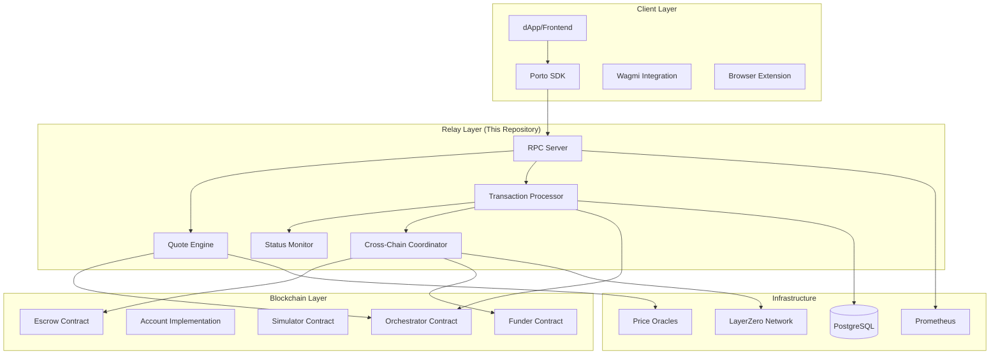
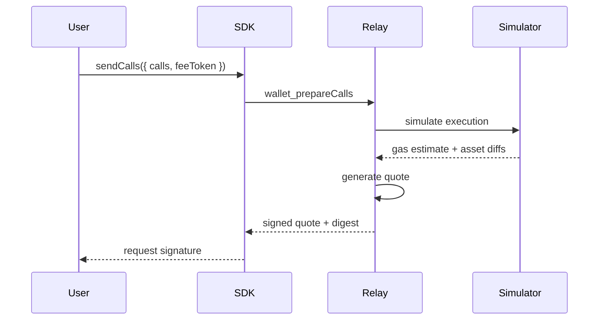
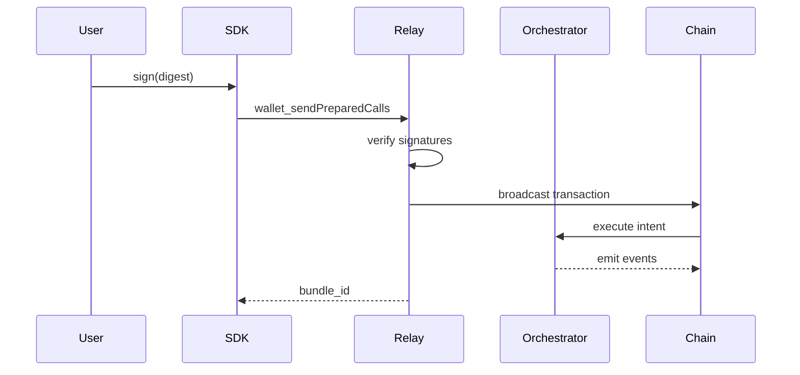
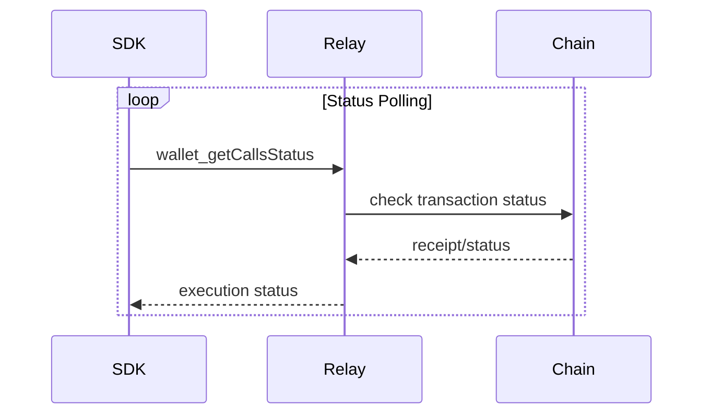
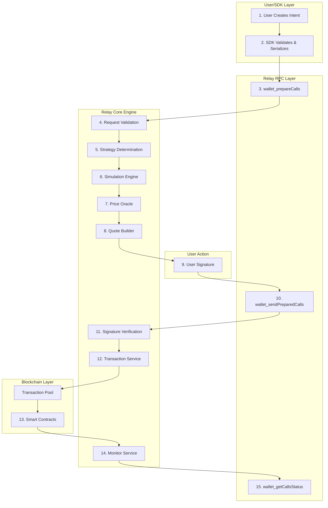
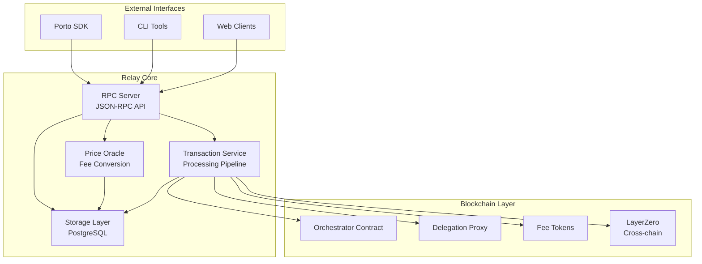

# Relay Architecture Overview

The Ithaca Relay is a transparent cross-chain transaction router for EIP-7702 accounts that provides fee abstraction and intent-based execution.

## Porto Ecosystem Architecture

The relay operates within the broader Porto ecosystem, which consists of three main layers:



## Design Principles

### 1. Intent-Driven Execution
Users express **what** they want to achieve, not **how** to achieve it. The relay handles execution details.

### 2. Trustless Operation  
- **Cryptographic Authorization**: Users sign specific intent digests
- **Atomic Execution**: Smart contracts enforce all-or-nothing execution
- **Non-Custodial**: Relay cannot access user funds directly

### 3. Cross-Chain Native Design
- **Unified Account Model**: Same account works across all chains
- **Atomic Cross-Chain**: Either all chains succeed or all fail
- **Intelligent Fund Sourcing**: Automatically routes liquidity

## Intent Lifecycle Phases

### Phase 1: Preparation


### Phase 2: Execution


### Phase 3: Monitoring


## Detailed Data Flow

The complete intent processing follows a 15-step data flow from SDK creation to final confirmation:



### Step-by-Step Implementation Details

#### Steps 1-2: Intent Creation and SDK Processing
**Client Layer Processing**:
- User creates high-level intent object
- SDK validates parameters and serializes to JSON-RPC

#### Steps 3-8: Preparation Phase (`wallet_prepareCalls`)

**Step 3**: RPC Endpoint Entry (**Implementation**: `src/rpc/relay.rs`)

**Step 4**: Request Validation (**Implementation**: `src/rpc/relay.rs`)
- Call structure validation  
- Chain support verification
- Account delegation checking

**Step 5**: Strategy Determination (**Implementation**: `src/rpc/relay.rs`)
- Single-chain vs multichain analysis
- Fund sourcing across chains (**Implementation**: `src/rpc/relay.rs`)
- Execution plan generation

**Step 6**: Simulation Execution (**Implementation**: `src/types/orchestrator.rs`)
- Off-chain contract simulation
- Asset diff calculation (**Implementation**: `src/asset.rs`)
- Gas usage prediction

**Step 7**: Price Oracle Consultation (**Implementation**: `src/price/oracle.rs`)
- Token price fetching from CoinGecko
- ETH-denominated conversion
- Fee calculation in payment token

**Step 8**: Quote Generation (**Implementation**: `src/rpc/relay.rs`)
- Quote signing with relay's private key
- EIP-712 digest calculation (**Implementation**: `src/types/intent.rs`)
- TTL and expiration setting

#### Step 9: User Signature
**Client-Side Action**:
- User reviews quote and asset diffs
- Signs EIP-712 digest with wallet (MetaMask, etc.)

#### Steps 10-12: Execution Phase (`wallet_sendPreparedCalls`)

**Step 10**: RPC Endpoint Entry (**Implementation**: `src/rpc/relay.rs`)

**Step 11**: Signature Verification (**Implementation**: `src/rpc/relay.rs`) 
- Quote expiration checking
- Quote signature validation
- User signature assembly

**Step 12**: Transaction Broadcasting (**Implementation**: `src/transactions/signer.rs`)
- Transaction signing with relay's key
- Network broadcast via provider
- Transaction service coordination (**Implementation**: `src/transactions/service.rs`)

#### Step 13: Blockchain Execution
**Smart Contract Processing**:
- Orchestrator validates intent and signatures
- Processes payments and executes calls atomically
- Emits execution events for monitoring

#### Steps 14-15: Monitoring Phase

**Step 14**: Status Monitoring (**Implementation**: `src/transactions/monitor.rs`)
- Transaction confirmation tracking
- Database status updates (**Implementation**: `src/storage/pg.rs`)
- Event log parsing

**Step 15**: Status Retrieval (**Implementation**: `src/rpc/relay.rs`)
- Bundle status aggregation
- Receipt processing
- Final status determination

## High-Level Architecture



## Core Components

### 1. RPC Server (`src/rpc/`)

The JSON-RPC server provides the main interface for clients to interact with the relay.

**Key modules**:
- **`relay.rs`** - Main relay endpoints (`wallet_prepareCalls`, `wallet_sendPreparedCalls`, `wallet_getCallsStatus`)
- **`account.rs`** - Account management and delegation
- **`onramp.rs`** - Onramp integration

**Server setup** (**Implementation**: `src/spawn.rs`):
```rust
// Creates JSON-RPC server with wallet namespace
let mut rpc = relay.into_rpc();
```

**Request handling pattern**:
1. **Validation** - Request structure and parameters
2. **Processing** - Business logic execution
3. **Response** - Structured JSON-RPC response

### 2. Transaction Service (`src/transactions/`)

Handles the complete transaction lifecycle from intent preparation to blockchain confirmation.

**Core components**:
- **`service.rs`** - Main transaction orchestration service
- **`signer.rs`** - Transaction signing and broadcasting
- **`monitor.rs`** - Transaction status monitoring
- **`fees.rs`** - Fee estimation and calculation

**Transaction pipeline**:
1. **Queue** (**Implementation**: `src/transactions/service.rs`) - Per-EOA nonce ordering
2. **Sign** (**Implementation**: `src/transactions/signer.rs`) - Cryptographic signing
3. **Broadcast** (**Implementation**: `src/transactions/signer.rs`) - Network submission
4. **Monitor** (**Implementation**: `src/transactions/monitor.rs`) - Confirmation tracking

### 3. Storage Layer (`src/storage/`)

Provides persistent storage with PostgreSQL backend and in-memory testing support.

**Storage abstractions**:
- **`api.rs`** - Storage trait definitions
- **`pg.rs`** - PostgreSQL implementation
- **`memory.rs`** - In-memory implementation for tests

**Key storage entities**:
- **Transactions** (**Schema**: `migrations/0004_multiple_transactions.sql`)
- **Bundles** (**Schema**: `migrations/0013_pending_bundles.sql`) 
- **Accounts** (**Schema**: `migrations/0006_entrypoint.sql`)
- **Intents** (**Schema**: `migrations/0008_intent.sql`)

**Database migrations** (**Location**: `migrations/`) are applied automatically on startup.

### 4. Price Oracle (`src/price/`)

Fetches token prices for fee conversion and payment processing.

**Components**:
- **`oracle.rs`** - Main oracle coordination
- **`fetchers/coingecko.rs`** - CoinGecko price fetching
- **`metrics.rs`** - Price oracle metrics

**Price flow**:
1. **Fetch** - External API calls (CoinGecko, etc.)
2. **Cache** - In-memory price caching with TTL
3. **Convert** - ETH-denominated price conversion

### 5. Cross-Chain Operations (`src/interop/`)

Handles multichain intent execution with atomic settlement guarantees.

**Key components**:
- **`escrow.rs`** - Fund locking and unlocking
- **`settler/`** - Settlement message processing
  - **`layerzero/`** - LayerZero message handling
  - **`processor.rs`** - Settlement state machine
- **`refund/`** - Refund processing for failed operations

**Bundle state machine** (**Implementation**: `src/transactions/interop.rs`):

See [Bundle State Machine Diagram](../diagrams/bundle_state_machine.svg) for visual representation.

**States** (**Definition**: `src/transactions/interop.rs`):
- `Init` → `LiquidityLocked` → `SourceQueued` → `SourceConfirmed` → `DestinationQueued` → `DestinationConfirmed` → `SettlementsQueued` → `Done`

## Type System (`src/types/`)

The relay uses a comprehensive type system for type safety and clear interfaces.

**Core domain types**:
- **`intent.rs`** - Intent structures and validation
- **`quote.rs`** - Quote generation and signing
- **`call.rs`** - Call execution types
- **`account.rs`** - Account management types

**RPC types** (**Location**: `src/types/rpc/`):
- **`calls.rs`** - Request/response structures
- **`capabilities.rs`** - Client capability negotiation

**Contract interfaces** (**Location**: `src/types/`):
- **`orchestrator.rs`** - Orchestrator contract interface
- **`simulator.rs`** - Simulation contract interface

## Configuration System (`src/config.rs`)

Supports YAML configuration with CLI overrides.

**Configuration structure** (**Implementation**: `src/config.rs`):
- **Server** - RPC server settings (address, port, CORS)
- **Chain** - Blockchain endpoints and fee tokens
- **Quote** - Quote TTL and gas estimation settings
- **Storage** - Database connection parameters
- **Oracle** - Price fetching configuration

**Configuration precedence**:
1. CLI arguments (highest priority)
2. YAML configuration file
3. Default values (lowest priority)

## Error Handling (`src/error/`)

Comprehensive error handling with context and structured error types.

**Error hierarchy** (**Implementation**: `src/error/mod.rs`):
- **`RelayError`** - Top-level error type
- **Module errors** - Specific error types per module
  - `QuoteError` (**Implementation**: `src/error/quote.rs`)
  - `IntentError` (**Implementation**: `src/error/intent.rs`)
  - `StorageError` (**Implementation**: `src/error/storage.rs`)

**Error handling patterns**:
- Use `eyre` for error context
- Structured error responses for RPC
- Metrics collection on errors

## Metrics and Observability (`src/metrics/`)

Built-in Prometheus metrics and OpenTelemetry tracing.

**Metrics collection**:
- **`transport.rs`** - HTTP metrics transport
- **`periodic/`** - Background metric collection jobs
  - **`balance.rs`** - Account balance monitoring
  - **`latency.rs`** - Request latency tracking

**Tracing** (**Integration**: `src/otlp.rs`):
- Request tracing with correlation IDs
- Database query tracing
- Cross-chain operation tracking

## Development Patterns

### Async Architecture

The relay is built on Tokio async runtime with message-passing between components.

**Service pattern** (**Example**: `src/transactions/service.rs`):
- Services expose handle types for communication
- Background tasks process messages
- Clean shutdown with graceful termination

### Database Integration

Uses SQLx for compile-time checked SQL queries.

**Query pattern** (**Example**: `src/storage/pg.rs`):
```rust
// Compile-time checked SQL
let result = sqlx::query!("SELECT * FROM transactions WHERE id = $1", id)
    .fetch_one(&self.pool)
    .await?;
```

### Testing Architecture

**E2E testing framework** (**Implementation**: `tests/e2e/environment.rs`):
- Standardized test environment setup
- Contract deployment and funding
- Relay service integration
- Multi-chain test support

## Security Considerations

### Private Key Management

**Signer architecture** (**Implementation**: `src/signers/`):
- **`p256.rs`** - P256 elliptic curve signing
- **`webauthn.rs`** - WebAuthn hardware signing
- **`dyn.rs`** - Dynamic signer selection

### Transaction Validation

**Validation layers**:
1. **RPC validation** - Request structure and parameters
2. **Intent validation** (**Implementation**: `src/types/intent.rs`) - Business logic validation
3. **Contract validation** - On-chain execution validation

### Access Control

**Permission system** (**Implementation**: `src/types/rpc/permission.rs`):
- Account delegation verification
- Intent authorization checking
- Rate limiting and quota management

## Performance Optimizations

### Connection Pooling

**Database connections** (**Implementation**: `src/storage/pg.rs`):
- PostgreSQL connection pooling with SQLx
- Configurable pool size and timeouts

**RPC connections** (**Implementation**: `src/provider.rs`):
- HTTP/WebSocket provider pooling
- Automatic failover between endpoints

### Caching Strategies

**Price caching** (**Implementation**: `src/price/oracle.rs`):
- In-memory price cache with TTL
- Fallback to constant rates

**Simulation caching** - State override reuse for gas estimation

### Concurrent Processing

**Transaction processing** (**Implementation**: `src/transactions/service.rs`):
- Per-chain transaction queues
- Parallel processing with nonce ordering
- Load balancing across signers

---

## Related Documentation

- **[RPC Endpoints](rpc-endpoints.md)** - Detailed RPC implementation
- **[Transaction Pipeline](transaction-pipeline.md)** - End-to-end transaction flow
- **[Cross-Chain Operations](cross-chain.md)** - Multichain implementation details
- **[Storage Layer](storage-layer.md)** - Database schema and operations

---

💡 **Development Tip**: Use `src/lib.rs` as the main entry point to understand module organization and dependencies.