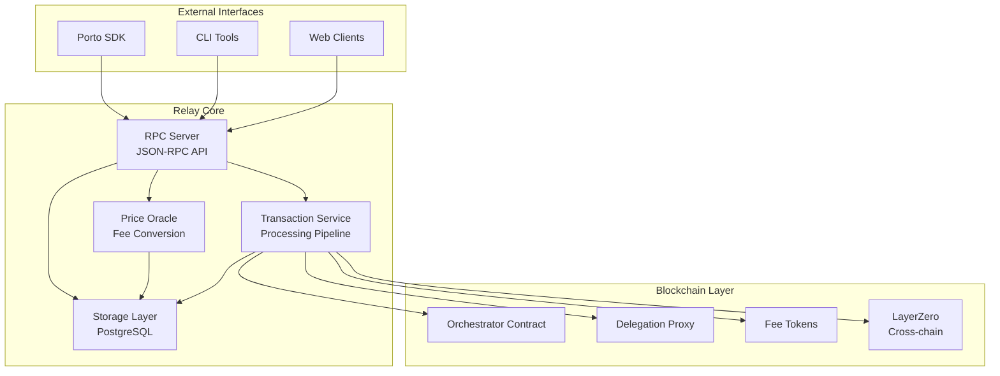

# Relay Architecture Overview

The Ithaca Relay is a transparent cross-chain transaction router for EIP-7702 accounts that provides fee abstraction and intent-based execution.

## Porto Ecosystem Context

The relay operates within the broader Porto ecosystem. For a detailed architectural overview of how the relay integrates with Porto's client layer, blockchain contracts, and infrastructure components, see [Porto Integration Architecture](porto-integration.md#porto-ecosystem-architecture).

## Design Principles

### 1. Intent-Driven Execution
Users express **what** they want to achieve, not **how** to achieve it. The relay handles execution details.

### 2. Trustless Operation  
- **Cryptographic Authorization**: Users sign specific intent digests
- **Atomic Execution**: Smart contracts enforce all-or-nothing execution
- **Non-Custodial**: Relay cannot access user funds directly

### 3. Cross-Chain Native Design
- **Unified Account Model**: Same account works across all chains
- **Atomic Cross-Chain**: Either all chains succeed or all fail
- **Intelligent Fund Sourcing**: Automatically routes liquidity

## Intent Processing Flow

The relay processes intents through three main phases:

1. **Preparation** (`wallet_prepareCalls`) - Validate, simulate, and generate signed quote
2. **Execution** (`wallet_sendPreparedCalls`) - Verify signature and broadcast transaction  
3. **Monitoring** (`wallet_getCallsStatus`) - Track status and provide updates

For detailed step-by-step flow, see [Transaction Pipeline](transaction-pipeline.md).


## High-Level Architecture



## Core Components

### 1. RPC Server (`src/rpc/`)

The JSON-RPC server provides the main interface for clients. For detailed endpoint documentation and implementation details, see:
- **[RPC API Reference](../apis/rpc-reference.md)** - Complete API specification
- **[RPC Endpoints Implementation](rpc-endpoints.md)** - Technical implementation details

### 2. Transaction Service (`src/transactions/`)

Handles the complete transaction lifecycle from intent preparation to blockchain confirmation.

**Core components**:
- **`service.rs`** - Main transaction orchestration service
- **`signer.rs`** - Transaction signing and broadcasting
- **`monitor.rs`** - Transaction status monitoring
- **`fees.rs`** - Fee estimation and calculation

**Transaction pipeline**:
1. **Queue** (**Implementation**: `src/transactions/service.rs`) - Per-EOA nonce ordering
2. **Sign** (**Implementation**: `src/transactions/signer.rs`) - Cryptographic signing
3. **Broadcast** (**Implementation**: `src/transactions/signer.rs`) - Network submission
4. **Monitor** (**Implementation**: `src/transactions/monitor.rs`) - Confirmation tracking

### 3. Storage Layer (`src/storage/`)

Provides persistent storage with PostgreSQL backend and in-memory testing support.

**Storage abstractions**:
- **`api.rs`** - Storage trait definitions
- **`pg.rs`** - PostgreSQL implementation
- **`memory.rs`** - In-memory implementation for tests

**Key storage entities**:
- **Transactions** (**Schema**: `migrations/0004_multiple_transactions.sql`)
- **Bundles** (**Schema**: `migrations/0013_pending_bundles.sql`) 
- **Accounts** (**Schema**: `migrations/0006_entrypoint.sql`)
- **Intents** (**Schema**: `migrations/0008_intent.sql`)

**Database migrations** (**Location**: `migrations/`) are applied automatically on startup.

### 4. Price Oracle (`src/price/`)

Fetches token prices for fee conversion and payment processing.

**Components**:
- **`oracle.rs`** - Main oracle coordination
- **`fetchers/coingecko.rs`** - CoinGecko price fetching
- **`metrics.rs`** - Price oracle metrics

**Price flow**:
1. **Fetch** - External API calls (CoinGecko, etc.)
2. **Cache** - In-memory price caching with TTL
3. **Convert** - ETH-denominated price conversion

### 5. Cross-Chain Operations (`src/interop/`)

Handles multichain intent execution with atomic settlement guarantees.

**Key components**:
- **`escrow.rs`** - Fund locking and unlocking
- **`settler/`** - Settlement message processing
  - **`layerzero/`** - LayerZero message handling
  - **`processor.rs`** - Settlement state machine
- **`refund/`** - Refund processing for failed operations

**Bundle state machine** (**Implementation**: `src/transactions/interop.rs`):

See [Bundle State Machine Diagram](../diagrams/bundle_state_machine.svg) for visual representation.

**States** (**Definition**: `src/transactions/interop.rs`):
- `Init` → `LiquidityLocked` → `SourceQueued` → `SourceConfirmed` → `DestinationQueued` → `DestinationConfirmed` → `SettlementsQueued` → `Done`

## Type System (`src/types/`)

The relay uses a comprehensive type system for type safety and clear interfaces.

**Core domain types**:
- **`intent.rs`** - Intent structures and validation
- **`quote.rs`** - Quote generation and signing
- **`call.rs`** - Call execution types
- **`account.rs`** - Account management types

**RPC types** (**Location**: `src/types/rpc/`):
- **`calls.rs`** - Request/response structures
- **`capabilities.rs`** - Client capability negotiation

**Contract interfaces** (**Location**: `src/types/`):
- **`orchestrator.rs`** - Orchestrator contract interface
- **`simulator.rs`** - Simulation contract interface

## Configuration System (`src/config.rs`)

Supports YAML configuration with CLI overrides.

**Configuration structure** (**Implementation**: `src/config.rs`):
- **Server** - RPC server settings (address, port, CORS)
- **Chain** - Blockchain endpoints and fee tokens
- **Quote** - Quote TTL and gas estimation settings
- **Storage** - Database connection parameters
- **Oracle** - Price fetching configuration

**Configuration precedence**:
1. CLI arguments (highest priority)
2. YAML configuration file
3. Default values (lowest priority)

## Error Handling (`src/error/`)

Comprehensive error handling with context and structured error types for reliable operation and debugging.

### Error Hierarchy

**Main error type** (**Implementation**: `src/error/mod.rs`):

```rust
#[derive(Debug, Error)]
pub enum RelayError {
    Asset(AssetError),                 // Asset-related errors
    Auth(AuthError),                   // Authentication/authorization errors
    Quote(QuoteError),                 // Quote generation/validation errors
    Intent(IntentError),               // Intent processing errors
    Keys(KeysError),                   // Cryptographic key errors
    Storage(StorageError),             // Database/storage errors
    UnsupportedChain(ChainId),         // Chain not supported
    UnsupportedOrchestrator(Address),  // Contract not supported
    InsufficientFunds { required: U256, chain_id: ChainId, asset: Address },
    Settlement(SettlementError),       // Cross-chain settlement errors
    // ... additional error variants
}
```

### Module-Specific Errors

#### Intent Errors (**Implementation**: `src/error/intent.rs`)

| Error | Description | Recovery |
|-------|-------------|----------|
| `MissingSender` | No 'from' address provided | Provide sender address |
| `MissingKey` | No signing key available | Set up signing key |
| `SimulationError` | Intent simulation failed | Check call data and state |
| `InvalidIntentDigest` | Wrong intent digest | Re-generate quote |
| `PausedOrchestrator` | Orchestrator is paused | Wait for unpause |

#### Quote Errors (**Implementation**: `src/error/quote.rs`)

| Error | Description | Recovery |
|-------|-------------|----------|
| `Expired` | Quote TTL exceeded | Request new quote |
| `InvalidSignature` | Invalid relay signature | Report issue to support |
| `PriceOutdated` | Price data is stale | Wait for price update |
| `InsufficientLiquidity` | Not enough liquidity | Try different amount/token |

#### Storage Errors (**Implementation**: `src/error/storage.rs`)

| Error | Description | Recovery |
|-------|-------------|----------|
| `ConnectionFailed` | Database connection lost | Check database connectivity |
| `TransactionFailed` | Database transaction failed | Retry operation |
| `NotFound` | Record not found | Verify bundle/transaction ID |
| `ConstraintViolation` | Database constraint violated | Check data integrity |

### Error Context and Tracing

**Error context with `eyre`**:

```rust
use eyre::{Context, Result};

async fn process_intent(intent: Intent) -> Result<BundleId> {
    let validated = validate_intent(&intent)
        .context("Failed to validate intent structure")?;
    
    let simulated = simulate_execution(&validated)
        .context("Intent simulation failed - check call data")?;
    
    let bundle_id = create_bundle(simulated)
        .context("Failed to create execution bundle")?;
    
    Ok(bundle_id)
}
```

**Structured error responses for RPC**:

```rust
impl From<RelayError> for jsonrpsee::types::error::ErrorObject<'static> {
    fn from(err: RelayError) -> Self {
        match err {
            RelayError::UnsupportedChain(chain_id) => {
                invalid_params(format!("Chain {} not supported", chain_id))
            }
            RelayError::InsufficientFunds { required, asset, chain_id } => {
                invalid_params(format!(
                    "Insufficient {} on chain {}: need {}", 
                    asset, chain_id, required
                ))
            }
            RelayError::Intent(intent_err) => (*intent_err).into(),
            _ => internal_rpc(err.to_string()),
        }
    }
}
```

### Error Recovery Patterns

#### Automatic Recovery

**Transaction retry with exponential backoff**:

```rust
async fn submit_transaction_with_retry(
    tx: Transaction, 
    max_retries: u32
) -> Result<TxHash> {
    let mut delay = Duration::from_secs(1);
    
    for attempt in 0..max_retries {
        match submit_transaction(&tx).await {
            Ok(hash) => return Ok(hash),
            Err(RelayError::RpcError(_)) if attempt < max_retries - 1 => {
                tracing::warn!("RPC error, retrying in {:?}", delay);
                tokio::time::sleep(delay).await;
                delay *= 2; // Exponential backoff
            }
            Err(e) => return Err(e),
        }
    }
    
    Err(RelayError::InternalError("Max retries exceeded".into()))
}
```

**Graceful degradation for price oracle failures**:

```rust
async fn get_token_price(&self, token: Address) -> Result<f64> {
    // Try primary price source
    if let Ok(price) = self.primary_oracle.get_price(token).await {
        return Ok(price);
    }
    
    // Fall back to cached price if available
    if let Some(cached) = self.price_cache.get(&token) {
        if cached.age() < Duration::from_hours(1) {
            tracing::warn!("Using cached price for {}", token);
            return Ok(cached.price);
        }
    }
    
    // Use configured constant rate as last resort
    if let Some(rate) = self.config.quote.constant_rate {
        tracing::warn!("Using constant rate for {}", token);
        return Ok(rate);
    }
    
    Err(RelayError::InternalError("No price available".into()))
}
```

#### Manual Recovery

**Bundle state recovery**:

```rust
// Recover stuck bundles
async fn recover_stuck_bundles(&self) -> Result<()> {
    let stuck_bundles = self.storage
        .get_bundles_by_status(BundleStatus::SourceQueued)
        .await?
        .into_iter()
        .filter(|b| b.created_at < Utc::now() - Duration::from_secs(300))
        .collect::<Vec<_>>();
    
    for bundle in stuck_bundles {
        tracing::warn!("Recovering stuck bundle: {}", bundle.id);
        
        // Check actual transaction status
        let tx_status = self.check_transaction_status(&bundle).await?;
        
        match tx_status {
            TransactionStatus::Confirmed => {
                self.transition_bundle_state(bundle.id, BundleStatus::SourceConfirmed).await?;
            }
            TransactionStatus::Failed => {
                self.initiate_refund(bundle.id).await?;
            }
            TransactionStatus::Pending => {
                // Re-submit with higher gas price
                self.escalate_transaction_fee(&bundle).await?;
            }
        }
    }
    
    Ok(())
}
```

### Error Monitoring and Alerting

**Error metrics collection**:

```rust
use metrics::{counter, histogram};

impl ErrorHandler {
    pub fn record_error(&self, error: &RelayError) {
        // Count errors by type
        counter!("relay.errors.total", "type" => error.error_type()).increment(1);
        
        // Track error severity
        match error.severity() {
            ErrorSeverity::Critical => {
                counter!("relay.errors.critical").increment(1);
                self.send_alert(error).await;
            }
            ErrorSeverity::Warning => {
                counter!("relay.errors.warning").increment(1);
            }
            ErrorSeverity::Info => {
                counter!("relay.errors.info").increment(1);
            }
        }
    }
}
```

**Health check integration**:

```rust
// Include error rates in health checks
async fn health_check(&self) -> HealthStatus {
    let error_rate = self.metrics.get_error_rate_last_5min();
    let critical_errors = self.metrics.get_critical_errors_last_hour();
    
    if critical_errors > 0 {
        return HealthStatus::Unhealthy("Critical errors detected".into());
    }
    
    if error_rate > 0.05 { // 5% error rate threshold
        return HealthStatus::Degraded(format!("High error rate: {:.2}%", error_rate * 100.0));
    }
    
    HealthStatus::Healthy
}
```

### Debugging and Troubleshooting

#### Log Analysis

**Structured logging for errors**:

```rust
use tracing::{error, warn, info, instrument};

#[instrument(skip(self), fields(bundle_id = %bundle_id))]
async fn process_bundle(&self, bundle_id: BundleId) -> Result<()> {
    info!("Starting bundle processing");
    
    match self.execute_bundle(bundle_id).await {
        Ok(()) => {
            info!("Bundle processing completed successfully");
        }
        Err(e) => {
            error!(
                error = %e,
                error_chain = ?e.chain().collect::<Vec<_>>(),
                "Bundle processing failed"
            );
            
            // Include additional context for debugging
            let bundle = self.storage.get_bundle(bundle_id).await?;
            error!(
                bundle_status = ?bundle.status,
                bundle_age = ?(Utc::now() - bundle.created_at),
                "Bundle state information"
            );
        }
    }
    
    Ok(())
}
```

#### Common Error Patterns

**Intent simulation failures**:

```bash
# Check for simulation errors in logs
grep "simulation failed" relay.log

# Common causes:
# - Insufficient balance for token transfers
# - Contract function reverts
# - Gas limit too low
# - State changes between quote and execution
```

**Cross-chain settlement issues**:

```bash
# Monitor LayerZero message status
grep "layerzero.*failed" relay.log

# Check settlement timeouts
grep "settlement.*timeout" relay.log

# Verify escrow contract state
cast call $ESCROW_ADDRESS "getLockedFunds(bytes32)" $BUNDLE_ID
```

**Database connection issues**:

```bash
# Check database connectivity
psql $DATABASE_URL -c "SELECT 1"

# Monitor connection pool status
curl http://localhost:8323/health/database

# Check for connection pool exhaustion
grep "connection pool" relay.log
```

### Error Prevention

**Input validation patterns**:

```rust
// Validate intent before processing
fn validate_intent(intent: &Intent) -> Result<(), IntentError> {
    // Check for empty calls
    if intent.calls.is_empty() {
        return Err(IntentError::EmptyCalls);
    }
    
    // Validate call targets
    for call in &intent.calls {
        if call.to == Address::ZERO {
            return Err(IntentError::InvalidCallTarget);
        }
    }
    
    // Check gas limits
    let total_gas: u64 = intent.calls.iter()
        .map(|call| call.gas_limit.unwrap_or(21000))
        .sum();
    
    if total_gas > MAX_INTENT_GAS_LIMIT {
        return Err(IntentError::GasLimitExceeded);
    }
    
    Ok(())
}
```

**Circuit breaker pattern for external services**:

```rust
struct CircuitBreaker {
    failure_count: AtomicU32,
    last_failure: Mutex<Option<Instant>>,
    failure_threshold: u32,
    timeout: Duration,
}

impl CircuitBreaker {
    async fn call<F, T>(&self, operation: F) -> Result<T>
    where F: Future<Output = Result<T>>
    {
        // Check if circuit is open
        if self.is_open().await {
            return Err(RelayError::ServiceUnavailable);
        }
        
        match operation.await {
            Ok(result) => {
                self.reset();
                Ok(result)
            }
            Err(e) => {
                self.record_failure().await;
                Err(e)
            }
        }
    }
}
```

## Metrics and Observability (`src/metrics/`)

Built-in Prometheus metrics and OpenTelemetry tracing.

**Metrics collection**:
- **`transport.rs`** - HTTP metrics transport
- **`periodic/`** - Background metric collection jobs
  - **`balance.rs`** - Account balance monitoring
  - **`latency.rs`** - Request latency tracking

**Tracing** (**Integration**: `src/otlp.rs`):
- Request tracing with correlation IDs
- Database query tracing
- Cross-chain operation tracking

## Development Patterns

### Async Architecture

The relay is built on Tokio async runtime with message-passing between components.

**Service pattern** (**Example**: `src/transactions/service.rs`):
- Services expose handle types for communication
- Background tasks process messages
- Clean shutdown with graceful termination

### Database Integration

Uses SQLx for compile-time checked SQL queries.

**Query pattern** (**Example**: `src/storage/pg.rs`):
```rust
// Compile-time checked SQL
let result = sqlx::query!("SELECT * FROM transactions WHERE id = $1", id)
    .fetch_one(&self.pool)
    .await?;
```

### Testing Architecture

**E2E testing framework** (**Implementation**: `tests/e2e/environment.rs`):
- Standardized test environment setup
- Contract deployment and funding
- Relay service integration
- Multi-chain test support

## Security Considerations

### Private Key Management

**Signer architecture** (**Implementation**: `src/signers/`):
- **`p256.rs`** - P256 elliptic curve signing
- **`webauthn.rs`** - WebAuthn hardware signing
- **`dyn.rs`** - Dynamic signer selection

### Transaction Validation

**Validation layers**:
1. **RPC validation** - Request structure and parameters
2. **Intent validation** (**Implementation**: `src/types/intent.rs`) - Business logic validation
3. **Contract validation** - On-chain execution validation

### Access Control

**Permission system** (**Implementation**: `src/types/rpc/permission.rs`):
- Account delegation verification
- Intent authorization checking
- Rate limiting and quota management

## Performance Optimizations

### Connection Pooling

**Database connections** (**Implementation**: `src/storage/pg.rs`):
- PostgreSQL connection pooling with SQLx
- Configurable pool size and timeouts

**RPC connections** (**Implementation**: `src/provider.rs`):
- HTTP/WebSocket provider pooling
- Automatic failover between endpoints

### Caching Strategies

**Price caching** (**Implementation**: `src/price/oracle.rs`):
- In-memory price cache with TTL
- Fallback to constant rates

**Simulation caching** - State override reuse for gas estimation

### Concurrent Processing

**Transaction processing** (**Implementation**: `src/transactions/service.rs`):
- Per-chain transaction queues
- Parallel processing with nonce ordering
- Load balancing across signers

---

## Related Documentation

- **[RPC Endpoints](rpc-endpoints.md)** - Detailed RPC implementation
- **[Transaction Pipeline](transaction-pipeline.md)** - End-to-end transaction flow
- **[Cross-Chain Operations](cross-chain.md)** - Multichain implementation details
- **[Storage Layer](storage-layer.md)** - Database schema and operations

---

💡 **Development Tip**: Use `src/lib.rs` as the main entry point to understand module organization and dependencies.