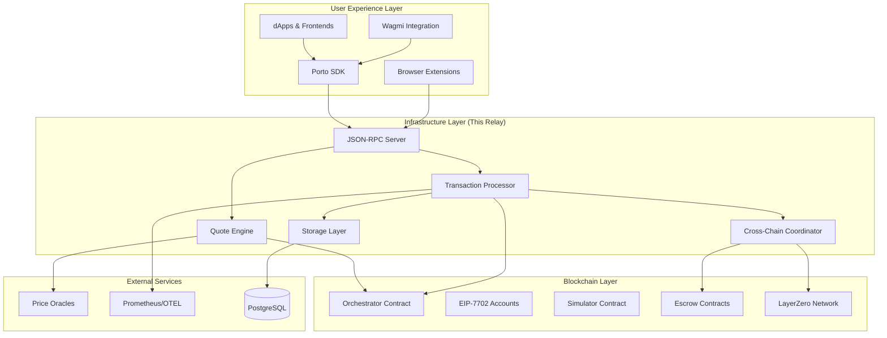
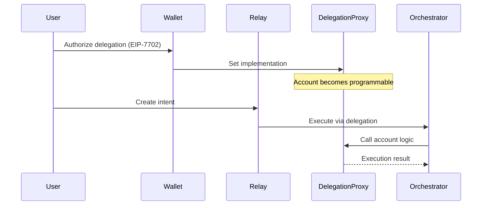
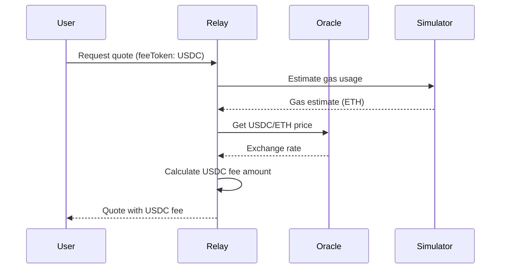

# Porto Ecosystem Integration

This document explains how the Ithaca Relay integrates with the broader Porto ecosystem and provides context for the intent-based architecture design decisions.

## Porto Ecosystem Overview

The Ithaca Relay is a core component of the Porto ecosystem - a next-generation account abstraction stack that enables intent-based, cross-chain transactions with fee abstraction capabilities.

### Ecosystem Components



## Intent-Based Architecture Philosophy

### Traditional vs Intent-Based Model

**Traditional Ethereum Transactions**:
- Users specify exact execution details (gas, nonce, contract calls)
- Complex UX requiring technical knowledge
- Single-chain execution only
- Gas payment in native tokens only

**Porto Intent-Based Model**:
- Users express desired outcomes, not implementation details  
- Relay handles execution complexity
- Native cross-chain capabilities
- Pay fees in any supported token

### Core Design Principles

#### 1. Declarative User Interface

Users express **what** they want to achieve:

```typescript
// Porto Intent
const intent = {
  calls: [{ to: tokenAddress, data: transferCall }],
  feeToken: 'USDC', // Pay fees in any token
  // Relay automatically handles:
  // - Gas estimation and pricing
  // - Nonce management
  // - Cross-chain fund sourcing
  // - Execution optimization
}
```

**Relay Implementation**: The relay receives this high-level intent and translates it into optimized execution plans (**Implementation**: `src/rpc/relay.rs`).

#### 2. Trustless Execution Model

**Cryptographic Authorization**:
- Users sign EIP-712 structured data (**Implementation**: `src/types/intent.rs`)
- No custodial risk or trust assumptions
- Relay cannot access user funds directly

**Atomic Execution**:
- Smart contracts enforce all-or-nothing execution
- Simulation prevents failed transactions (**Implementation**: `src/types/orchestrator.rs`)
- Transparent pricing with binding quotes

#### 3. Cross-Chain Native Design

**Unified Account Model**:
- Same EIP-7702 account works across all supported chains
- Hierarchical key management with delegation
- Consistent UX regardless of chain complexity

**Intelligent Fund Sourcing**:
```rust
// Fund sourcing algorithm in src/rpc/relay.rs
async fn source_funds_multichain(
    account: Address,
    target_chain: ChainId, 
    required_asset: Address,
    amount: U256
) -> Result<FundingPlan> {
    // 1. Check existing balance on target chain
    // 2. Find optimal funding sources across chains
    // 3. Calculate cross-chain transfer costs
    // 4. Generate funding execution plan
}
```

## EIP-7702 Account Abstraction Integration

### Programmable EOA Architecture

Porto leverages EIP-7702 to create programmable EOAs (Externally Owned Accounts) that maintain compatibility with existing tooling while enabling advanced features.

**Key Benefits**:
- **Backward Compatibility**: Works with MetaMask, WalletConnect, etc.
- **Gradual Migration**: Users can opt-in to enhanced features
- **Standard Interfaces**: Compatible with existing wallet APIs

### Account Delegation Flow



**Implementation Details**:
- **Account validation** (**Implementation**: `src/rpc/account.rs`)
- **Delegation verification** (**Implementation**: `src/types/account.rs`)
- **Permission management** (**Implementation**: `src/types/rpc/permission.rs`)

## Client-Relay Integration Patterns

### SDK-to-Relay Communication

The Porto SDK abstracts relay complexity for developers:

```typescript
// Developer API (Porto SDK)
await porto.sendCalls({
  calls: [transferCall],
  feeToken: 'USDC'
})

// Translates to JSON-RPC calls:
// 1. wallet_prepareCalls - Get quote and simulation
// 2. [User signs EIP-712 digest]  
// 3. wallet_sendPreparedCalls - Execute intent
// 4. wallet_getCallsStatus - Monitor execution
```

### JSON-RPC API Integration

The relay exposes a `wallet_*` namespace following EIP-1193 patterns. For complete API documentation and implementation details, see:
- **[RPC API Reference](https://porto.sh/rpc-server)** - Full API specification
- **[RPC Endpoints Implementation](rpc-endpoints.md)** - Technical implementation

### Quote System Design

The relay provides binding quotes to prevent economic attacks:

```rust
// Quote structure in src/types/quote.rs
pub struct Quote {
    pub intent: Intent,
    pub ttl: u64,              // Time-to-live prevents stale quotes
    pub signature: Signature,   // Relay commitment to pricing
    pub eth_price: U256,       // Exchange rate at quote time
    pub native_fee_estimate: FeeEstimate,
}
```

**Security Properties**:
- **Time-bounded**: Quotes expire to prevent stale pricing
- **Cryptographically signed**: Relay cannot change pricing after issuance
- **Market-reflective**: Based on real-time oracle data

## Cross-Chain Intent Architecture

### Multi-Chain Execution Model

Porto enables atomic execution across multiple blockchains through a sophisticated settlement system.

**Example Scenario**: Buy 5 ETH NFT on Ethereum with funds from:
- 2 ETH from Polygon
- 1.5 ETH from Arbitrum  
- 1.5 ETH from Base

### Intent Decomposition

**Single Intent → Multiple Sub-Intents**:

```rust
// Intent classification in src/types/intent.rs
pub enum IntentKind {
    Single,                    // Standard single-chain intent
    MultiOutput {              // Final execution on destination chain
        leaf_index: usize,
        fund_transfers: Vec<(Address, U256)>,
        settler_context: Bytes,
    },
    MultiInput {               // Fund sourcing on source chains
        leaf_info: MerkleLeafInfo,
        fee: Option<(Address, U256)>,
    },
}
```

### Cross-Chain State Machine

The relay manages complex cross-chain state transitions:

**Bundle States** (**Implementation**: `src/transactions/interop.rs`):
1. `Init` - Intent received and validated
2. `LiquidityLocked` - Funds locked on source chains
3. `SourceQueued` - Source transactions submitted
4. `SourceConfirmed` - Source transactions confirmed
5. `DestinationQueued` - Destination transaction submitted
6. `DestinationConfirmed` - Destination transaction confirmed
7. `SettlementsQueued` - Settlement messages sent
8. `Done` - Complete cross-chain execution

**Visual Representation**: See [Bundle State Machine Diagram](../diagrams/bundle_state_machine.svg)

### LayerZero Integration

Porto uses LayerZero for secure cross-chain messaging:

**Settlement Flow** (**Implementation**: `src/interop/settler/processor.rs`):
1. **Escrow Creation**: Lock funds on source chains
2. **Message Dispatch**: Send execution proof via LayerZero
3. **Destination Execution**: Unlock funds and execute intent
4. **Settlement Confirmation**: Confirm completion across chains

## Fee Abstraction Implementation

### Multi-Token Fee Support

Users can pay fees in any supported ERC-20 token:

**Supported Fee Tokens**:
- USDC, USDT, DAI (stablecoins)
- WETH, WBTC (wrapped assets)
- Chain-native tokens on respective chains

### Price Oracle Integration

**Real-time Pricing** (**Implementation**: `src/price/oracle.rs`):
```rust
pub async fn get_price(&self, token: Address) -> Result<U256> {
    // 1. Check in-memory cache with TTL
    if let Some(cached) = self.cache.get(&token) {
        return Ok(cached.price);
    }
    
    // 2. Fetch from external APIs (CoinGecko)
    let price = self.fetcher.fetch_price(token).await?;
    
    // 3. Cache result with TTL
    self.cache.insert(token, price, self.ttl);
    
    Ok(price)
}
```

### Fee Calculation Flow



## Security Model Integration

### Trust Boundaries

**User ↔ Relay**:
- Cryptographic signatures provide authorization
- No custodial risk through non-custodial design
- Quote system prevents pricing manipulation

**Relay ↔ Smart Contracts**:
- On-chain enforcement of business logic
- Atomic execution guarantees
- Transparent state transitions

**Cross-Chain Security**:
- LayerZero's decentralized verification network
- Escrow contracts with time-based fallbacks
- Merkle proof validation for settlement

### Attack Vector Mitigations

| Attack Vector | Mitigation Strategy |
|---------------|-------------------|
| **Relay Censorship** | Multiple relay competition (future) |
| **Intent Manipulation** | Cryptographic signatures + EIP-712 |
| **Cross-Chain Fraud** | LayerZero verification + escrow timeouts |
| **Price Manipulation** | CoinGecko price feeds (additional oracles planned) |
| **Smart Contract Bugs** | Formal verification + comprehensive audits |

## Performance Considerations

### Scaling Bottlenecks

**Current Limitations**:
- Single relay point (centralized)
- PostgreSQL storage bottleneck (single region deployment; relays from different clusters communicate with central PostgreSQL instance)
- Quote generation latency for complex intents

**Optimization Strategies**:

#### Connection Pooling
**Database** (**Implementation**: `src/storage/pg.rs`):
- PostgreSQL connection pool with configurable limits
- Query optimization with prepared statements

**RPC Providers** (**Implementation**: `src/provider.rs`):
- HTTP/WebSocket provider pools per chain
- Automatic failover and load balancing

#### Caching Systems
**Price Caching** (**Implementation**: `src/price/oracle.rs`):
- In-memory cache with TTL expiration
- Reduces external API calls

**Simulation Caching**:
- Reuse gas estimates for similar intents
- State override optimization

#### Concurrent Processing
**Transaction Queues** (**Implementation**: `src/transactions/service.rs`):
- Per-EOA nonce ordering
- Parallel processing across chains
- Load balancing across signers

## Future Ecosystem Evolution

### Decentralized Relay Network

**Current State**: Single relay operated by Ithaca

**Future Vision**: Competitive network of independent relays

**Benefits**:
- Censorship resistance
- Geographic distribution
- Economic competition for better pricing

### Intent Composition

**Advanced Intent Patterns**:
```typescript
// Compose complex workflows
const swapIntent = createSwapIntent(tokenA, tokenB, amount)
const stakeIntent = createStakeIntent(tokenB, stakingPool)
const compoundIntent = compose(swapIntent, stakeIntent)
```

### AI-Powered Intent Generation

**Natural Language Interface**:
```typescript
const intent = await ai.generateIntent(
  "Buy 100 USDC worth of ETH and stake on Lido, pay fees in USDC"
)
```

## Development Integration Guidelines

### Adding New Features

1. **Understand Intent Model**: New features should fit the intent-based paradigm
2. **Cross-Chain Considerations**: Consider multi-chain implications from design start
3. **Fee Abstraction**: Support multiple payment tokens where applicable
4. **Security First**: Validate all inputs and maintain trustless properties

### Testing Strategies

**E2E Testing** (**Framework**: `tests/e2e/environment.rs`):
- Multi-chain test environments
- Contract deployment automation
- Realistic user flow simulation

**Unit Testing Patterns**:
- Mock external dependencies (oracles, providers)
- Test intent validation logic
- Verify quote generation accuracy

## Conclusion

The Ithaca Relay serves as the execution engine for Porto's intent-based architecture, bridging the gap between high-level user intents and low-level blockchain execution. By understanding both the broader ecosystem context and specific implementation details, developers can build features that leverage Porto's full potential while maintaining the security and performance characteristics that make intent-based execution viable at scale.

## Related Documentation

- **[Architecture Overview](overview.md)** - Detailed relay architecture
- **[RPC Endpoints](rpc-endpoints.md)** - JSON-RPC implementation details  
- **[Cross-Chain Operations](cross-chain.md)** - Multi-chain intent processing
- **[Transaction Pipeline](transaction-pipeline.md)** - End-to-end execution flow
- **[Porto Documentation](https://porto.sh)** - User-facing documentation and guides