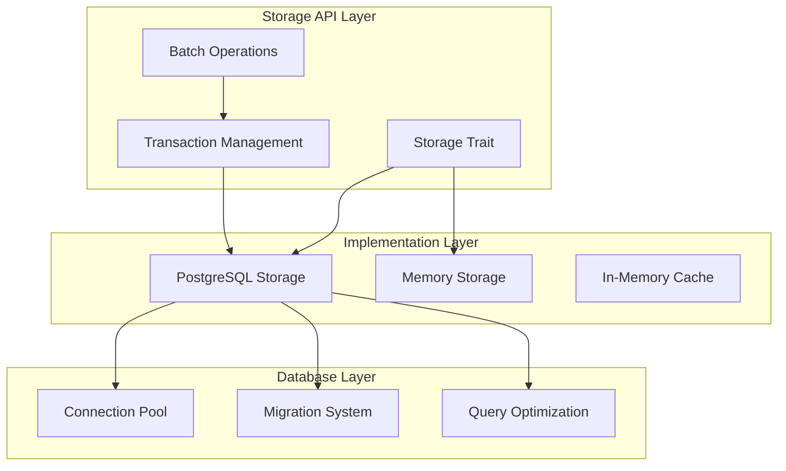

# Storage Layer Architecture

The relay uses a sophisticated storage system with PostgreSQL as the primary backend and in-memory implementations for testing. This document covers the database schema, storage abstractions, and data management patterns.

## Storage Architecture Overview



## Storage Abstractions

### Core Storage Trait

**Implementation**: `src/storage/api.rs`

The relay defines a common storage interface that abstracts over different backends:

```rust
#[async_trait]
pub trait Storage: Send + Sync {
    // Transaction operations
    async fn store_transaction(&self, tx: &Transaction) -> Result<()>;
    async fn get_transaction(&self, id: TransactionId) -> Result<Option<Transaction>>;
    async fn update_transaction_status(&self, id: TransactionId, status: TransactionStatus) -> Result<()>;
    
    // Bundle operations
    async fn store_bundle(&self, bundle: &Bundle) -> Result<()>;
    async fn get_bundle(&self, id: BundleId) -> Result<Option<Bundle>>;
    async fn update_bundle_status(&self, id: BundleId, status: BundleStatus) -> Result<()>;
    
    // Account operations
    async fn store_account(&self, account: &Account) -> Result<()>;
    async fn get_account(&self, address: Address) -> Result<Option<Account>>;
    
    // Query operations
    async fn list_pending_transactions(&self, limit: usize) -> Result<Vec<Transaction>>;
    async fn list_bundles_by_status(&self, status: BundleStatus) -> Result<Vec<Bundle>>;
}
```

### Storage Implementations

#### PostgreSQL Storage

**Implementation**: `src/storage/pg.rs`

Production storage backend with full ACID compliance:

```rust
pub struct PgStorage {
    pool: PgPool,
    config: PgStorageConfig,
}

impl PgStorage {
    pub async fn new(database_url: &str) -> Result<Self> {
        let pool = PgPoolOptions::new()
            .max_connections(config.max_connections)
            .idle_timeout(Duration::from_secs(config.idle_timeout))
            .connect(database_url)
            .await?;
            
        // Run migrations on startup
        sqlx::migrate!("./migrations").run(&pool).await?;
        
        Ok(Self { pool, config })
    }
}
```

**Key Features**:
- **Connection Pooling**: Configurable connection limits and timeouts
- **Automatic Migrations**: Schema updates applied on startup
- **Compile-time Query Checking**: SQLx macro validation
- **Transaction Support**: Full ACID transaction semantics

#### Memory Storage

**Implementation**: `src/storage/memory.rs`

In-memory storage for testing and development:

```rust
pub struct MemoryStorage {
    transactions: RwLock<HashMap<TransactionId, Transaction>>,
    bundles: RwLock<HashMap<BundleId, Bundle>>,
    accounts: RwLock<HashMap<Address, Account>>,
}
```

**Usage Patterns**:
- Unit testing with isolated state
- Integration testing without database setup
- Development environments with faster iteration

## Database Schema

### Core Tables

#### Transactions Table

**Migration**: `migrations/0004_multiple_transactions.sql`

```sql
CREATE TABLE transactions (
    id UUID PRIMARY KEY,
    bundle_id UUID REFERENCES bundles(id),
    chain_id BIGINT NOT NULL,
    from_address BYTEA NOT NULL,
    to_address BYTEA,
    value NUMERIC(78, 0),
    data BYTEA,
    nonce BIGINT,
    gas_limit BIGINT,
    gas_price NUMERIC(78, 0),
    status transaction_status NOT NULL,
    hash BYTEA,
    created_at TIMESTAMPTZ DEFAULT NOW(),
    updated_at TIMESTAMPTZ DEFAULT NOW(),
    
    INDEX idx_transactions_bundle_id (bundle_id),
    INDEX idx_transactions_status (status),
    INDEX idx_transactions_chain_id (chain_id),
    INDEX idx_transactions_from_address (from_address)
);
```

#### Bundles Table

**Migration**: `migrations/0013_pending_bundles.sql`

```sql
CREATE TABLE bundles (
    id UUID PRIMARY KEY,
    intent_hash BYTEA NOT NULL,
    status bundle_status NOT NULL,
    bundle_type bundle_type NOT NULL,
    created_at TIMESTAMPTZ DEFAULT NOW(),
    updated_at TIMESTAMPTZ DEFAULT NOW(),
    
    INDEX idx_bundles_status (status),
    INDEX idx_bundles_intent_hash (intent_hash),
    INDEX idx_bundles_created_at (created_at)
);
```

#### Accounts Table

**Migration**: `migrations/0006_entrypoint.sql`

```sql
CREATE TABLE accounts (
    address BYTEA PRIMARY KEY,
    delegation_proxy BYTEA,
    nonce BIGINT DEFAULT 0,
    created_at TIMESTAMPTZ DEFAULT NOW(),
    updated_at TIMESTAMPTZ DEFAULT NOW(),
    
    INDEX idx_accounts_delegation_proxy (delegation_proxy)
);
```

### Specialized Tables

#### Intents Table

**Migration**: `migrations/0008_intent.sql`

Stores intent metadata and execution context:

```sql
CREATE TABLE intents (
    hash BYTEA PRIMARY KEY,
    bundle_id UUID REFERENCES bundles(id),
    from_address BYTEA NOT NULL,
    calls JSONB NOT NULL,
    fee_token BYTEA,
    nonce NUMERIC(78, 0),
    signature BYTEA,
    created_at TIMESTAMPTZ DEFAULT NOW()
);
```

#### Bundle Transactions Mapping

**Migration**: `migrations/0014_bundle_transactions_mapping.sql`

Maps bundles to their constituent transactions:

```sql
CREATE TABLE bundle_transactions (
    bundle_id UUID REFERENCES bundles(id),
    transaction_id UUID REFERENCES transactions(id),
    transaction_type transaction_type NOT NULL,
    
    PRIMARY KEY (bundle_id, transaction_id),
    INDEX idx_bundle_transactions_bundle_id (bundle_id)
);
```

## Query Patterns

### Transaction Queries

#### Efficient Transaction Lookup

**Implementation**: `src/storage/pg.rs`

```rust
pub async fn get_pending_transactions_by_signer(
    &self,
    signer: Address,
    limit: usize
) -> Result<Vec<Transaction>> {
    let transactions = sqlx::query_as!(
        Transaction,
        r#"
        SELECT id, bundle_id, chain_id, from_address, status, created_at
        FROM transactions 
        WHERE from_address = $1 
            AND status IN ('queued', 'in_flight')
        ORDER BY nonce ASC
        LIMIT $2
        "#,
        signer.as_slice(),
        limit as i64
    )
    .fetch_all(&self.pool)
    .await?;
    
    Ok(transactions)
}
```

#### Bundle Status Aggregation

```rust
pub async fn get_bundle_completion_status(
    &self,
    bundle_id: BundleId
) -> Result<BundleCompletionStatus> {
    let result = sqlx::query!(
        r#"
        SELECT 
            COUNT(*) as total_transactions,
            COUNT(CASE WHEN status = 'confirmed' THEN 1 END) as confirmed_count,
            COUNT(CASE WHEN status = 'failed' THEN 1 END) as failed_count
        FROM transactions 
        WHERE bundle_id = $1
        "#,
        bundle_id.as_slice()
    )
    .fetch_one(&self.pool)
    .await?;
    
    Ok(BundleCompletionStatus {
        total: result.total_transactions as usize,
        confirmed: result.confirmed_count as usize,
        failed: result.failed_count as usize,
    })
}
```

### Performance Optimization

#### Index Strategy

**Optimized indexes for common query patterns**:

```sql
-- Transaction lookups by bundle
CREATE INDEX CONCURRENTLY idx_transactions_bundle_status 
ON transactions(bundle_id, status);

-- Recent transaction queries
CREATE INDEX CONCURRENTLY idx_transactions_recent 
ON transactions(created_at DESC) WHERE status != 'confirmed';

-- Cross-chain bundle queries  
CREATE INDEX CONCURRENTLY idx_bundles_multichain 
ON bundles(status, bundle_type) WHERE bundle_type = 'multichain';
```

#### Query Optimization

**Batch operations for efficiency**:

```rust
pub async fn batch_update_transaction_status(
    &self,
    updates: Vec<(TransactionId, TransactionStatus)>
) -> Result<()> {
    let mut tx = self.pool.begin().await?;
    
    for (transaction_id, status) in updates {
        sqlx::query!(
            "UPDATE transactions SET status = $1, updated_at = NOW() WHERE id = $2",
            status as TransactionStatus,
            transaction_id
        )
        .execute(&mut *tx)
        .await?;
    }
    
    tx.commit().await?;
    Ok(())
}
```

## Migration System

### Migration Strategy

**Migration Location**: `migrations/`

The relay uses SQLx migrations with automatic application:

```rust
// Applied automatically on startup
pub async fn run_migrations(pool: &PgPool) -> Result<()> {
    sqlx::migrate!("./migrations")
        .run(pool)
        .await
        .map_err(|e| StorageError::Migration(e))?;
    
    Ok(())
}
```

### Migration Best Practices

#### Additive Migrations

**Safe schema changes**:
```sql
-- ✅ Safe: Add new column with default
ALTER TABLE transactions 
ADD COLUMN retry_count INTEGER DEFAULT 0;

-- ✅ Safe: Add new index
CREATE INDEX CONCURRENTLY idx_transactions_retry 
ON transactions(retry_count);
```

#### Backwards Compatibility

**Version-aware queries**:
```rust
// Handle optional columns gracefully
let query = if self.has_retry_column().await? {
    "SELECT id, status, retry_count FROM transactions WHERE id = $1"
} else {
    "SELECT id, status, 0 as retry_count FROM transactions WHERE id = $1"
};
```

### Key Migrations

| Migration | Description | Impact |
|-----------|-------------|--------|
| `0001_initial.sql` | Basic schema setup | Creates core tables |
| `0004_multiple_transactions.sql` | Multi-transaction support | Enables complex bundles |
| `0008_intent.sql` | Intent storage | Stores user intents |
| `0013_pending_bundles.sql` | Bundle state tracking | Cross-chain coordination |
| `0014_bundle_transactions_mapping.sql` | Bundle-transaction relationships | Complex bundle queries |

## Connection Management

### Connection Pooling

**Configuration**: `src/storage/pg.rs`

```rust
pub struct PgStorageConfig {
    pub max_connections: u32,      // Maximum concurrent connections
    pub idle_timeout: u64,         // Seconds before closing idle connections
    pub acquire_timeout: u64,      // Seconds to wait for connection
    pub max_lifetime: Option<u64>, // Maximum connection lifetime
}

impl Default for PgStorageConfig {
    fn default() -> Self {
        Self {
            max_connections: 10,
            idle_timeout: 600,      // 10 minutes
            acquire_timeout: 30,    // 30 seconds
            max_lifetime: Some(3600), // 1 hour
        }
    }
}
```

### Health Monitoring

**Connection health checks**:

```rust
impl PgStorage {
    pub async fn health_check(&self) -> Result<StorageHealth> {
        let start = Instant::now();
        
        // Simple connectivity test
        let result = sqlx::query!("SELECT 1 as health_check")
            .fetch_one(&self.pool)
            .await;
            
        let latency = start.elapsed();
        
        match result {
            Ok(_) => Ok(StorageHealth {
                status: HealthStatus::Healthy,
                latency,
                active_connections: self.pool.size(),
                idle_connections: self.pool.num_idle(),
            }),
            Err(e) => Ok(StorageHealth {
                status: HealthStatus::Unhealthy(e.to_string()),
                latency,
                active_connections: 0,
                idle_connections: 0,
            })
        }
    }
}
```

## Caching Strategy

### In-Memory Caching

**Implementation**: `src/storage/pg.rs`

```rust
pub struct CachedPgStorage {
    storage: PgStorage,
    cache: Arc<RwLock<LruCache<CacheKey, CacheValue>>>,
    cache_ttl: Duration,
}

impl CachedPgStorage {
    pub async fn get_transaction_cached(
        &self,
        id: TransactionId
    ) -> Result<Option<Transaction>> {
        let cache_key = CacheKey::Transaction(id);
        
        // Check cache first
        {
            let cache = self.cache.read().await;
            if let Some(cached) = cache.get(&cache_key) {
                if !cached.is_expired() {
                    return Ok(Some(cached.transaction.clone()));
                }
            }
        }
        
        // Fetch from database
        let transaction = self.storage.get_transaction(id).await?;
        
        // Update cache
        if let Some(ref tx) = transaction {
            let mut cache = self.cache.write().await;
            cache.put(cache_key, CacheValue {
                transaction: tx.clone(),
                expires_at: Instant::now() + self.cache_ttl,
            });
        }
        
        Ok(transaction)
    }
}
```

### Cache Invalidation

**Event-driven cache updates**:

```rust
pub async fn update_transaction_status_with_cache_invalidation(
    &self,
    id: TransactionId,
    status: TransactionStatus
) -> Result<()> {
    // Update database
    self.storage.update_transaction_status(id, status).await?;
    
    // Invalidate cache
    let mut cache = self.cache.write().await;
    cache.pop(&CacheKey::Transaction(id));
    
    Ok(())
}
```

## Error Handling

### Storage Error Types

**Implementation**: `src/error/storage.rs`

```rust
#[derive(Debug, thiserror::Error)]
pub enum StorageError {
    #[error("Database connection failed: {0}")]
    Connection(#[from] sqlx::Error),
    
    #[error("Migration failed: {0}")]
    Migration(sqlx::migrate::MigrateError),
    
    #[error("Transaction not found: {id}")]
    TransactionNotFound { id: TransactionId },
    
    #[error("Bundle not found: {id}")]
    BundleNotFound { id: BundleId },
    
    #[error("Serialization error: {0}")]
    Serialization(#[from] serde_json::Error),
    
    #[error("Constraint violation: {constraint}")]
    ConstraintViolation { constraint: String },
}
```

### Error Recovery

**Automatic retry patterns**:

```rust
pub async fn store_transaction_with_retry(
    &self,
    transaction: &Transaction,
    max_retries: usize
) -> Result<()> {
    let mut attempts = 0;
    
    loop {
        match self.store_transaction(transaction).await {
            Ok(()) => return Ok(()),
            Err(StorageError::Connection(_)) if attempts < max_retries => {
                attempts += 1;
                let delay = Duration::from_millis(100 * attempts as u64);
                tokio::time::sleep(delay).await;
                continue;
            }
            Err(e) => return Err(e),
        }
    }
}
```

## Testing Patterns

### Test Database Setup

**Test utilities**: `tests/storage/`

```rust
pub async fn test_postgres_storage() -> PgStorage {
    let database_url = std::env::var("TEST_DATABASE_URL")
        .unwrap_or_else(|_| "postgresql://localhost/ithaca_relay_test".to_string());
    
    let storage = PgStorage::new(&database_url).await.unwrap();
    
    // Clean up test data
    storage.cleanup_test_data().await.unwrap();
    
    storage
}
```

### Roundtrip Testing

**Implementation**: `tests/storage/roundtrip.rs`

```rust
#[tokio::test]
async fn test_transaction_roundtrip() {
    let storage = test_postgres_storage().await;
    
    let original_tx = Transaction {
        id: TransactionId::new(),
        bundle_id: Some(BundleId::new()),
        chain_id: ChainId::from(1),
        status: TransactionStatus::Queued,
        created_at: Utc::now(),
        // ... other fields
    };
    
    // Store transaction
    storage.store_transaction(&original_tx).await.unwrap();
    
    // Retrieve transaction
    let retrieved_tx = storage
        .get_transaction(original_tx.id)
        .await
        .unwrap()
        .unwrap();
    
    // Verify data integrity
    assert_eq!(original_tx.id, retrieved_tx.id);
    assert_eq!(original_tx.status, retrieved_tx.status);
    assert_eq!(original_tx.bundle_id, retrieved_tx.bundle_id);
}
```

## Configuration

### Storage Configuration

**YAML configuration**:

```yaml
storage:
  url: "postgresql://localhost/ithaca_relay"
  max_connections: 10
  idle_timeout: 600
  acquire_timeout: 30
  max_lifetime: 3600
  
  # Cache settings
  cache:
    enabled: true
    max_size: 10000
    ttl: 300
    
  # Migration settings
  migrations:
    auto_run: true
    timeout: 300
```

### Environment Variables

```bash
# Database connection
DATABASE_URL="postgresql://localhost/ithaca_relay"

# Connection pool settings
DB_MAX_CONNECTIONS=10
DB_IDLE_TIMEOUT=600

# Cache settings
STORAGE_CACHE_ENABLED=true
STORAGE_CACHE_TTL=300
```

---

## Related Documentation

- **[Architecture Overview](overview.md)** - Complete system design
- **[Transaction Pipeline](transaction-pipeline.md)** - Transaction processing flow
- **[RPC Endpoints](rpc-endpoints.md)** - API implementation details
- **[Testing Guide](../development/testing.md)** - Storage testing patterns

---

💡 **Development Tip**: Use the storage roundtrip tests as examples when adding new storage entities. They ensure data integrity and help catch serialization issues early.