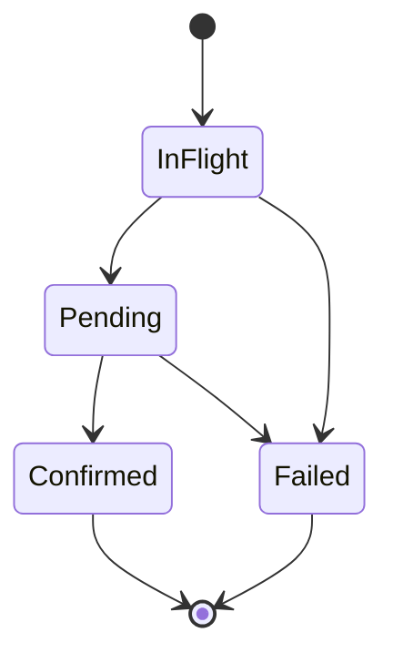
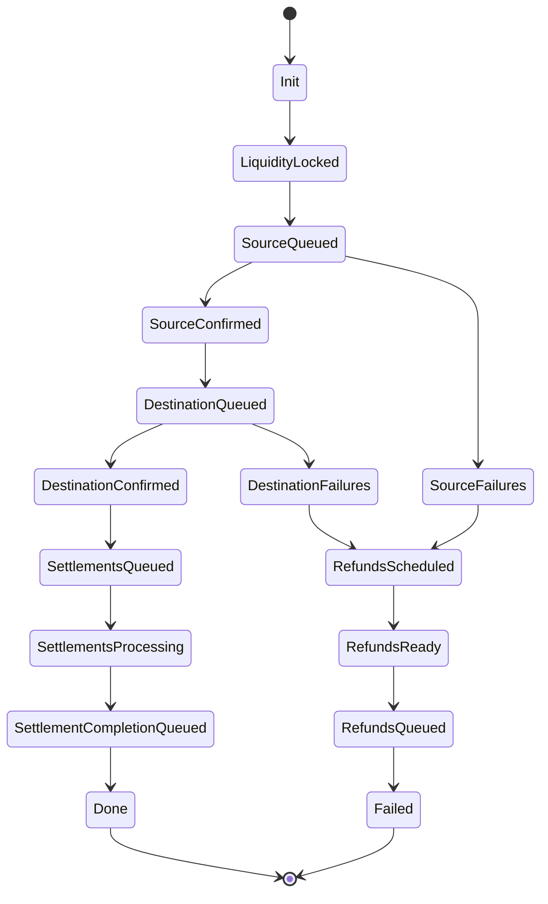

# Transaction Pipeline Architecture

This document details the complete transaction processing pipeline from intent submission to blockchain confirmation.

## Pipeline Overview

The transaction pipeline consists of five main stages that transform user intents into blockchain transactions:



```mermaid
graph LR
    subgraph "Input Stage"
        INT[Intent Submission]
        VAL[Validation]
    end
    
    subgraph "Processing Stage"  
        QUEUE[Transaction Queue]
        SIGN[Signing Service]
        BROAD[Broadcasting]
    end
    
    subgraph "Monitoring Stage"
        MON[Status Monitoring]
        UPD[Database Updates]
        NOTIF[Status Notifications]
    end
    
    subgraph "Completion Stage"
        CONF[Confirmation]
        FINAL[Finalization]
    end
    
    INT --> VAL
    VAL --> QUEUE
    QUEUE --> SIGN
    SIGN --> BROAD
    BROAD --> MON
    MON --> UPD
    UPD --> NOTIF
    NOTIF --> CONF
    CONF --> FINAL
```

## Stage 1: Intent Validation and Routing

### Intent Classification

**Implementation**: `src/rpc/relay.rs:451-491`

When a signed intent arrives via `wallet_sendPreparedCalls`, the relay classifies the execution type:

```rust
// Route to appropriate execution path
if quotes.ty().multi_chain_root.is_none() {
    self.send_single_chain_intent(&quotes, capabilities, signature, bundle_id).await
} else {
    self.send_multichain_intents(quotes, capabilities, signature, bundle_id).await
}
```

**Classification criteria**:
- **Single-chain**: All operations on one blockchain
- **Multi-chain**: Requires cross-chain coordination and settlement

### Validation Steps

**Quote verification** (**Implementation**: `src/rpc/relay.rs:460-480`):
1. **Expiration check**: Ensure quote hasn't expired
2. **Signature verification**: Validate relay's quote signature  
3. **User signature assembly**: Build complete signature payload

**Bundle creation** (**Implementation**: `src/rpc/relay.rs:485-491`):
- Generate deterministic `BundleId` from quote hash
- Create bundle tracking entry in database
- Initialize transaction status monitoring

## Stage 2: Transaction Service Processing

### Queue Management

**Transaction queuing** (**Implementation**: `src/transactions/service.rs:150-180`):

The transaction service maintains per-EOA ordered queues to ensure nonce consistency:

```rust
pub async fn send_transaction(
    &self,
    transaction: TransactionRequest,
    bundle: Option<BundleId>,
    chain_id: ChainId,
    signer_preference: SignerPreference,
) -> Result<(), TransactionServiceError> {
    self.queue_transaction(transaction, bundle, chain_id, signer_preference).await
}
```

**Queue characteristics**:
- **Per-EOA ordering**: Maintains nonce sequence per account
- **Capacity limits**: Prevents queue overflow  
- **Priority handling**: Supports transaction prioritization
- **Deadlock prevention**: Timeout mechanisms for stalled transactions

### Signer Selection

**Signer management** (**Implementation**: `src/transactions/service.rs:85-120`):
- **Load balancing**: Distribute transactions across available signers
- **Health monitoring**: Pause signers with low balance or errors
- **Preference handling**: Route to preferred signers when possible

## Stage 3: Transaction Signing and Broadcasting

### Signing Process

**Transaction signing** (**Implementation**: `src/transactions/signer.rs:201-240`):

```rust
async fn sign_transaction(
    &self,
    provider: &DynProvider,
    wallet: &NetworkWallet,  
    mut transaction: TransactionRequest,
) -> Result<B256, SignerError> {
    // Sign the transaction
    let signed = wallet.sign_transaction_from(&mut transaction).await?;
    
    // Broadcast to network
    let hash = provider.send_raw_transaction(&signed.encoded_2718()).await?;
    
    Ok(hash)
}
```

**Signing pipeline**:
1. **Transaction preparation**: Set gas, nonce, and fee parameters
2. **Cryptographic signing**: Sign with relay's private key
3. **Network broadcasting**: Submit to blockchain network
4. **Hash tracking**: Store transaction hash for monitoring

### Validation Before Signing

**Pre-flight validation** (**Implementation**: `src/transactions/signer.rs:224-250`):
- **Gas estimation**: Simulate transaction to estimate gas usage
- **Balance checking**: Ensure signer has sufficient funds
- **Nonce verification**: Confirm nonce is correct and sequential

### Broadcasting Strategy

**Network submission** (**Implementation**: `src/transactions/signer.rs:142-180`):
- **Provider selection**: Choose optimal RPC endpoint
- **Retry logic**: Handle temporary network failures
- **Fee escalation**: Increase gas price for stuck transactions

## Stage 4: Transaction Monitoring

### Status Tracking

**Transaction monitoring** (**Implementation**: `src/transactions/monitor.rs:65-120`):

```rust
pub async fn watch_transaction(
    &self,
    tx_hash: B256,
    timeout: Option<Duration>,
) -> Result<TransactionReceipt, TransactionMonitoringError> {
    let config = PendingTransactionConfig::new()
        .with_timeout(timeout.unwrap_or(self.default_timeout))
        .with_block_range(self.block_range);

    let receipt = self.provider
        .watch_pending_transaction(config.clone())
        .get_receipt(tx_hash)
        .await?;

    Ok(receipt)
}
```

**Monitoring features**:
- **Multi-provider watching**: Monitor via multiple RPC endpoints for faster detection
- **Configurable timeouts**: Handle network congestion gracefully
- **Block confirmation tracking**: Wait for specified confirmation depth

### Status State Machine

**Transaction states** (**Implementation**: `src/transactions/transaction.rs:25-45`):



**State descriptions**:
- **InFlight**: Transaction being prepared and broadcast
- **Pending**: Submitted to mempool, waiting for confirmation
- **Confirmed**: Included in block and confirmed
- **Failed**: Broadcast failed or transaction reverted

### Database Integration

**Status persistence** (**Implementation**: `src/storage/pg.rs:150-200`):
- **Atomic updates**: Transaction status changes are atomic
- **Historical tracking**: Maintain complete transaction history
- **Query optimization**: Indexed queries for status lookup

## Stage 5: Bundle Management (Multi-Chain)

### Cross-Chain Coordination

**Bundle state machine** (**Implementation**: `src/transactions/interop.rs:85-200`):

For multi-chain intents, the relay coordinates complex state transitions:



**State management** (**Implementation**: `src/transactions/interop.rs:25-65`):
- **Atomic transitions**: State changes are validated and atomic
- **Recovery mechanisms**: Handle failed cross-chain operations
- **Timeout handling**: Automatic refunds for stalled operations

### Settlement Processing

**LayerZero integration** (**Implementation**: `src/interop/settler/layerzero/processor.rs:40-100`):
- **Message verification**: Validate cross-chain messages
- **Settlement execution**: Process settlement transactions
- **State synchronization**: Keep settlement state consistent

## Error Handling and Recovery

### Error Classification

**Error types** (**Implementation**: `src/error/mod.rs:15-100`):

| Error Category | Example | Recovery Strategy |
|----------------|---------|-------------------|
| **Validation errors** | Invalid nonce | Reject transaction |
| **Network errors** | RPC timeout | Retry with backoff |
| **Signing errors** | Insufficient balance | Pause signer |
| **Confirmation errors** | Transaction reverted | Mark as failed |

### Recovery Mechanisms

**Automatic recovery** (**Implementation**: `src/transactions/signer.rs:300-350`):
- **Nonce gap closure**: Detect and fill nonce gaps
- **Fee escalation**: Increase gas price for stuck transactions
- **Signer rotation**: Switch to healthy signers on errors

**Manual intervention**:
- **Transaction replacement**: Replace stuck transactions
- **Bundle recovery**: Restart failed cross-chain bundles
- **Database consistency**: Repair inconsistent state

## Performance Optimization

### Throughput Optimization

**Concurrent processing** (**Implementation**: `src/transactions/service.rs:120-180`):
- **Parallel execution**: Process multiple transactions simultaneously
- **Queue partitioning**: Separate queues per chain and signer
- **Batch operations**: Group database operations for efficiency

### Latency Optimization

**Fast confirmation detection**:
- **Multiple providers**: Query multiple RPC endpoints in parallel
- **WebSocket subscriptions**: Real-time transaction status updates
- **Optimistic confirmations**: Report status on first confirmation

### Resource Management

**Connection pooling** (**Implementation**: `src/provider.rs:25-100`):
- **Database connections**: SQLx connection pooling
- **RPC connections**: HTTP/WebSocket connection reuse
- **Memory management**: Efficient data structures and cleanup

## Monitoring and Metrics

### Pipeline Metrics

**Key performance indicators** (**Implementation**: `src/metrics/transport.rs:25-100`):
- **Transaction throughput**: Transactions per second
- **Confirmation latency**: Time from submission to confirmation
- **Error rates**: Failed transaction percentages
- **Queue depths**: Pending transaction counts

### Alerting

**Critical alerts**:
- **High error rates**: Excessive transaction failures
- **Signer health**: Low balance or connection issues
- **Queue overflow**: Transaction queue capacity limits
- **Confirmation delays**: Unusually slow confirmations

### Observability

**Tracing integration** (**Implementation**: `src/otlp.rs:25-100`):
- **Request correlation**: Track transactions end-to-end
- **Performance profiling**: Identify bottlenecks
- **Error context**: Detailed error information

## Configuration

### Pipeline Configuration

**Transaction service config** (**Implementation**: `src/config.rs:85-120`):
```yaml
transaction:
  queue_capacity: 1000          # Max pending transactions per signer
  confirmation_timeout: 300     # Seconds to wait for confirmation
  max_gas_price: 100_000_000_000 # Maximum gas price in wei
  retry_attempts: 3             # Network retry attempts
```

**Monitoring config**:
```yaml
monitoring:
  poll_interval: 5              # Status polling interval (seconds)
  confirmation_blocks: 1        # Required confirmation depth
  provider_timeout: 30          # RPC request timeout (seconds)
```

### Chain-Specific Settings

**Per-chain configuration**:
- **Gas price strategies**: EIP-1559 vs legacy pricing
- **Confirmation requirements**: Different security levels
- **Provider endpoints**: Multiple RPC endpoints per chain
- **Settlement contracts**: Cross-chain coordination addresses

---

## Related Documentation

- **[System Overview](overview.md)** - High-level architecture
- **[RPC Endpoints](rpc-endpoints.md)** - API implementation details
- **[Cross-Chain Operations](cross-chain.md)** - Multi-chain coordination
- **[Storage Layer](storage-layer.md)** - Database schema and operations

---

💡 **Development Tip**: Use the bundle state machine diagram (`docs/diagrams/bundle_state_machine.svg`) to understand cross-chain transaction coordination and state transitions.