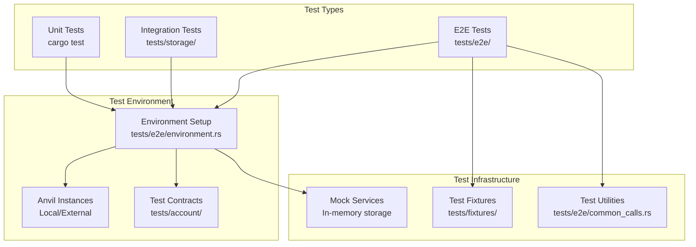

# Testing Guide

This guide covers testing patterns, setup, and best practices for the Ithaca Relay.

## Testing Architecture

The relay uses a comprehensive testing approach with multiple layers:



## Test Commands

### Basic Testing

```bash
# Run all tests
make test

# Run unit tests only (faster)
make test-unit

# Run tests with output
cargo test -- --nocapture

# Run specific test
cargo test test_name

# Run e2e tests
cargo e2e
```

### Coverage and Quality

```bash
# Generate test coverage
make cov-unit

# HTML coverage report
make cov-report-html

# Run with nextest (parallel execution)
cargo nextest run
```

## Unit Tests

### Testing Patterns

**Service testing** (**Example**: `src/transactions/service.rs:500+`):
```rust
#[cfg(test)]
mod tests {
    use super::*;
    use crate::storage::memory::MemoryStorage;

    #[tokio::test]
    async fn test_transaction_service() {
        let storage = Arc::new(MemoryStorage::new());
        let service = TransactionService::new(/* ... */);
        // Test service functionality
    }
}
```

**Mock dependencies**:
- Use `MemoryStorage` for database operations (**Implementation**: `src/storage/memory.rs`)
- Mock providers for blockchain interaction
- Mock price oracles for fee calculation

### Component Testing

**RPC endpoint testing** (**Implementation**: `tests/e2e/cases/relay.rs`):
- Request/response validation
- Error condition handling  
- Parameter validation
- Quote generation testing

**Storage layer testing** (**Implementation**: `tests/storage/roundtrip.rs`):
- Database schema validation
- Migration testing
- Query performance
- Data integrity checks

## Integration Tests

### Storage Integration

**Location**: `tests/storage/`

**Key test files**:
- **`roundtrip.rs`** - Database round-trip testing
- **`mod.rs`** - Storage test utilities

**Testing patterns**:
```rust
#[tokio::test]
async fn test_storage_operations() {
    let storage = test_postgres_storage().await;
    
    // Test data insertion
    let transaction = /* create test transaction */;
    storage.write_transaction(transaction).await.unwrap();
    
    // Test data retrieval
    let retrieved = storage.read_transaction(tx_id).await.unwrap();
    assert_eq!(retrieved.id, tx_id);
}
```

### Service Integration

**Transaction service integration**:
- Queue management testing
- Signer coordination
- Monitor integration
- Error propagation

## E2E Tests

### Environment Setup

**CRITICAL**: Always use the standardized test environment for e2e tests.

**Environment setup** (**Implementation**: `tests/e2e/environment.rs`):
```rust
use crate::e2e::Environment;

#[tokio::test]  
async fn test_relay_functionality() {
    let env = Environment::setup().await.unwrap();
    
    // Use pre-configured components:
    // - env.provider: Blockchain provider
    // - env.relay_endpoint: Relay RPC endpoint  
    // - env.orchestrator: Deployed orchestrator contract
    // - env.delegation: Deployed delegation contract
    // - env.erc20: Test ERC20 token
    // - env.accounts: Funded test accounts
}
```

### Test Categories

**E2E test organization** (**Location**: `tests/e2e/cases/`):

| Test File | Purpose | Key Tests |
|-----------|---------|-----------|
| **`relay.rs`** | Core relay functionality | RPC endpoint testing |
| **`calls.rs`** | Intent execution | End-to-end call processing |
| **`multi_chain.rs`** | Cross-chain intents | Multichain coordination |
| **`delegation.rs`** | Account delegation | EIP-7702 integration |
| **`fees.rs`** | Fee processing | Payment token handling |
| **`assets.rs`** | Asset management | Balance tracking |
| **`signature.rs`** | Cryptographic operations | Signature verification |
| **`liquidity.rs`** | Cross-chain liquidity | Fund sourcing |

### Key Test Patterns

**Full intent workflow** (**Implementation**: `tests/e2e/cases/calls.rs`):
```rust
#[tokio::test]
async fn test_intent_execution() {
    let env = Environment::setup().await.unwrap();
    
    // 1. Prepare calls
    let prepare_response = env.relay_client
        .prepare_calls(PrepareCallsParameters {
            calls: vec![/* test calls */],
            chain_id: env.chain_id,
            from: Some(env.eoa.address()),
            // ... other params
        })
        .await
        .unwrap();
    
    // 2. Sign intent
    let signature = env.eoa
        .sign_typed_data(&prepare_response.typed_data)
        .await
        .unwrap();
    
    // 3. Send prepared calls
    let send_response = env.relay_client
        .send_prepared_calls(SendPreparedCallsParameters {
            context: prepare_response.context,
            signature: signature.into(),
            key: prepare_response.key.unwrap(),
            capabilities: Default::default(),
        })
        .await
        .unwrap();
    
    // 4. Monitor status
    let status = env.relay_client
        .get_calls_status(send_response.id)
        .await
        .unwrap();
    
    assert_eq!(status.status, CallStatusCode::Confirmed);
}
```

**Multi-chain testing** (**Implementation**: `tests/e2e/cases/multichain_usdt_transfer.rs`):
- Cross-chain fund sourcing
- LayerZero message coordination  
- Settlement verification
- Refund processing

### Environment Variables

**Configuration** (**Implementation**: `tests/e2e/environment.rs`):

| Variable | Purpose | Default |
|----------|---------|---------|
| `TEST_CONTRACTS` | Contract artifacts directory | `tests/account/out` |
| `TEST_EXTERNAL_ANVIL_0` | External Anvil for chain 0 | None (spawns local) |
| `TEST_EXTERNAL_ANVIL_N` | External Anvil for chain N | None (spawns local) |
| `TEST_FORK_URL` | Fork URL for testing | None |
| `TEST_FORK_BLOCK_NUMBER` | Fork block number | Latest |
| `TEST_EOA_PRIVATE_KEY` | Test account private key | Default test key |
| `TEST_ORCHESTRATOR` | Orchestrator contract address | Deploys mock |
| `TEST_ERC20` | Test ERC20 token address | Deploys mock |

**Multi-chain setup example**:
```bash
# Chain 0: External Anvil
TEST_EXTERNAL_ANVIL_0="http://localhost:8545" \
# Chain 1: Local spawn  
# Chain 2: Different external
TEST_EXTERNAL_ANVIL_2="http://localhost:8547" \
cargo test test_multichain
```

## Contract Testing

### Prerequisites

**Required tools**:
- **Foundry** (`forge`, `cast`, `anvil`)
- **Git submodules** for contract dependencies

**Setup**:
```bash
# Initialize contract submodules
git submodule update --init --recursive

# Build contracts (required for e2e tests)
cd tests/account
forge build

# Build additional test contracts
cd tests/e2e/layerzero/contracts  
./build.sh
```

### Contract Artifacts

**Artifact locations** (**Configuration**: `tests/e2e/environment.rs`):
- **Main contracts**: `tests/account/out/` 
- **LayerZero mocks**: `tests/e2e/layerzero/contracts/out/`
- **Test fixtures**: `tests/fixtures/`

### Mock Contracts

**LayerZero testing** (**Implementation**: `tests/e2e/layerzero/contracts/src/`):
- **`MockEscrow.sol`** - Cross-chain escrow testing
- **`ReceiveUln302Mock.sol`** - LayerZero message receiving
- **`MinimalSendReceiveLib.sol`** - Message verification

## Performance Testing

### Load Testing

**Stress testing** (**Configuration**: `Dockerfile.stress`):
- High-throughput intent processing
- Concurrent user simulation
- Database performance under load
- Memory usage profiling

### Benchmarking

**Performance benchmarks**:
- RPC endpoint response times
- Database query performance
- Simulation execution speed
- Cross-chain coordination latency

**Benchmark commands**:
```bash
# CPU profiling build
make maxperf

# Memory profiling
cargo build --profile profiling

# Benchmark specific components
cargo bench
```

## Debugging Tests

### Common Issues

**Contract build failures**:
```bash
# Ensure forge is installed
which forge

# Update submodules  
git submodule update --recursive

# Clean and rebuild
cd tests/account && forge clean && forge build
```

**Anvil connection issues**:
```bash
# Check if Anvil is running
curl -X POST -H "Content-Type: application/json" \
  --data '{"jsonrpc":"2.0","method":"eth_chainId","params":[],"id":1}' \
  http://localhost:8545
  
# Use external Anvil
TEST_EXTERNAL_ANVIL_0="http://localhost:8545" cargo test
```

**Database connection errors**:
```bash
# Check PostgreSQL service
systemctl status postgresql

# Create test database
createdb ithaca_relay_test

# Set test database URL
export DATABASE_URL="postgresql://localhost/ithaca_relay_test"
```

### Test Utilities

**Common test helpers** (**Implementation**: `tests/e2e/common_calls.rs`):
- Account creation and funding
- Contract deployment helpers
- Transaction utilities
- Assertion helpers

**Debugging patterns**:
```rust
#[tokio::test]
async fn debug_test() {
    let env = Environment::setup().await.unwrap();
    
    // Enable tracing for debugging
    tracing_subscriber::fmt::init();
    
    // Add debug prints
    eprintln!("Test account: {:?}", env.eoa.address());
    eprintln!("Relay endpoint: {}", env.relay_endpoint);
    
    // Use nocapture to see output
    // cargo test debug_test -- --nocapture
}
```

## Test Data Management

### Fixtures

**Test fixtures** (**Location**: `tests/fixtures/`):
- **`merkle/`** (**Implementation**: `tests/fixtures/merkle/fixtures.rs`) - Merkle tree test data
- **`mod.rs`** - Fixture utilities

### Test Account Management

**Account setup** (**Implementation**: `tests/e2e/eoa.rs`):
- Deterministic test accounts
- Funding automation
- Key management
- Multi-signer setup

## Continuous Integration

### GitHub Actions

**CI pipeline considerations**:
- Contract compilation in CI
- Database setup for integration tests
- Multi-chain test coordination
- Performance regression detection

### Local CI Simulation

```bash
# Run full PR check locally
make pr

# Simulate CI environment
docker build -f Dockerfile .

# Run tests in clean environment
docker run --rm relay:latest make test
```

---

## Related Documentation

- **[Getting Started](getting-started.md)** - Development environment setup
- **[Contributing](contributing.md)** - Code quality and PR guidelines
- **[Troubleshooting](../troubleshooting/common-issues.md)** - Common testing issues

---

💡 **Best Practice**: Always use the standardized test environment (`tests/e2e/environment.rs`) for any test that requires blockchain interaction. This ensures consistency and reduces test flakiness.