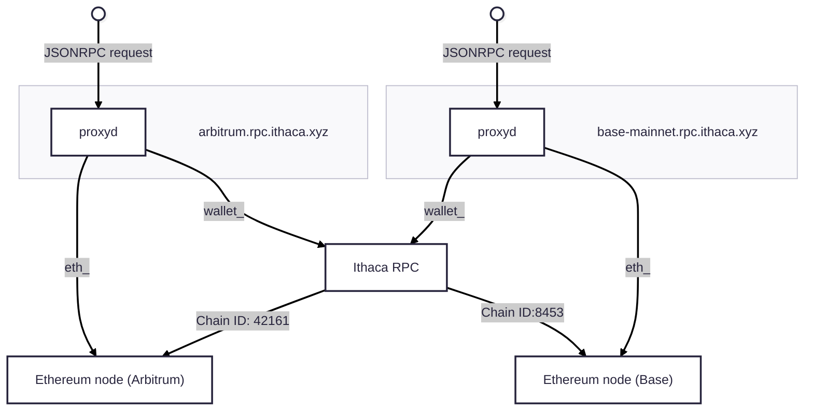

# Ithaca RPC overview

The Ithaca RPC is set up on our infrastructure as two components, one of them being the code base you are in right now ("relay", although this term is outdated), the other being a standard Ethereum node. Both are behind a proxy that routes traffic to one or the other depending on the JSONRPC namespace that is being called: for the namespaces `wallet_` and `relay_`, the traffic ends up here.

Porto SDK clients choose an RPC URL depending on what chain they want to read state from. If they wanted to read state from base for example, they would use `base-mainnet.rpc.ithaca.xyz`.

**It does not matter what RPC URL they use when writing state**, since the RPC has chain ID parameters on all requests where relevant. This means that even if an SDK client talks to the Base RPC, they would be able to send intents that are executed on Arbitrum.

## Assumptions

The Ithaca RPC makes the following assumptions about chains it operates on:

- [EIP-7702](https://eips.ethereum.org/EIPS/eip-7702) is enabled.
- [EIP-1559](https://eips.ethereum.org/EIPS/eip-1559) is enabled.
- [`eth_simulateV1`](https://docs.chainstack.com/reference/arbitrum-simulatev1) is enabled.
- The [RIP-7212](https://github.com/ethereum/RIPs/blob/master/RIPS/rip-7212.md) secp256r1 precompile is available, *or* a [shim](https://vectorized.github.io/solady/#/utils/p256?id=p256) is deployed[^1].

## General intent lifecycle

Users will send an unsigned bundle of calls, plus some extra data, like the key they are going to sign the bundle with, the token they want to pay fees in, and the chain ID for the chain they want the calls to be executed on.

This data is sent to `wallet_prepareCalls` ([`RelayApi::prepare_calls`](#)), where the calls are simulated using the [`Simulator`](#) contract to obtain the gas cost of executing the calls, and quoted a price. It is also here we determine whether the intent ends up involving a single chain, or multiple chains (m:1).

The RPC then makes two choices: 

- tbd
- tbd

Finally, the user signs the digest returned by the RPC (for single chain intents this is the digest of the intent, for multichain intents this is the digest of a merkle tree containing the digest of each intent), and the signed bundle is sent to `wallet_sendPreparedCalls` ([`RelayApi::send_prepared_calls`](#)).

The RPC validates the signed bundle to check that the digest did not change from what we OK'd to execute. Then, it is pushed to the [transaction service](#) which pulls transactions off of a queue, sends them, and ensures delivery on the different chains by managing fee bumps, nonces and so on.

[^1]: If the secp256r1 precompile is enabled, the address `0x0000000000001Ab2e8006Fd8B71907bf06a5BDEE` must additionally be a contract. This acts as a canary signalling the Solady P256 library that the precompile exists. If the canary is not deployed, the shim will be tried first. See [Solady's P256 library](https://github.com/Vectorized/solady/blob/a096f4fb0f65d1c6d6677ea6b13e9d41cb0bf798/src/utils/P256.sol#L19-L25).

## Fee estimation

## Transaction delivery

## Settlement

## Rebalancing
