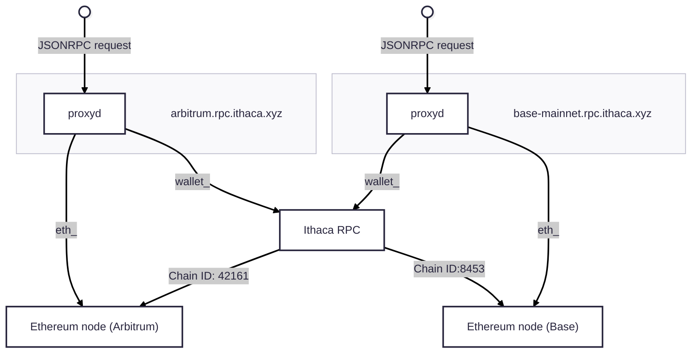

# Ithaca RPC overview

The Ithaca RPC is set up on our infrastructure as two components, one of them being the code base you are in right now, the other being a standard Ethereum node. Both are behind a proxy that routes traffic to one or the other depending on the JSONRPC namespace that is being called: for the namespaces `wallet_` and `relay_`, the traffic ends up here.

## Assumptions

The Ithaca RPC makes the following assumptions about nodes it connects to:

- [EIP-7702](#) is enabled.
- [EIP-1559](#) is enabled.
- [`eth_simulateV1`](#) is enabled.
- The [RIP-7212](#) secp256r1 precompile is available, *or* a [shim](#) is deployed[^1].

## General intent lifecycle

Users will send an unsigned bundle of calls, plus some extra data, like the key they are going to sign the bundle with, the token they want to pay fees in, and the chain ID for the chain they want the calls to be executed on.

This data is sent to `wallet_prepareCalls` ([`RelayApi::prepare_calls`](#)), where the calls are simulated using the [`Simulator`](#) contract to obtain the gas cost of executing the calls, and quoted a price. It is also here we determine whether the intent ends up involving a single chain, or multiple chains (m:1).

[^1]: If the secp256r1 precompile is enabled, the address `0x0000000000001Ab2e8006Fd8B71907bf06a5BDEE` must additionally be a contract. This acts as a canary signalling the Solady P256 library that the precompile exists. If the canary is not deployed, the shim will be tried first. See [Solady's P256 library](https://github.com/Vectorized/solady/blob/a096f4fb0f65d1c6d6677ea6b13e9d41cb0bf798/src/utils/P256.sol#L19-L25).
