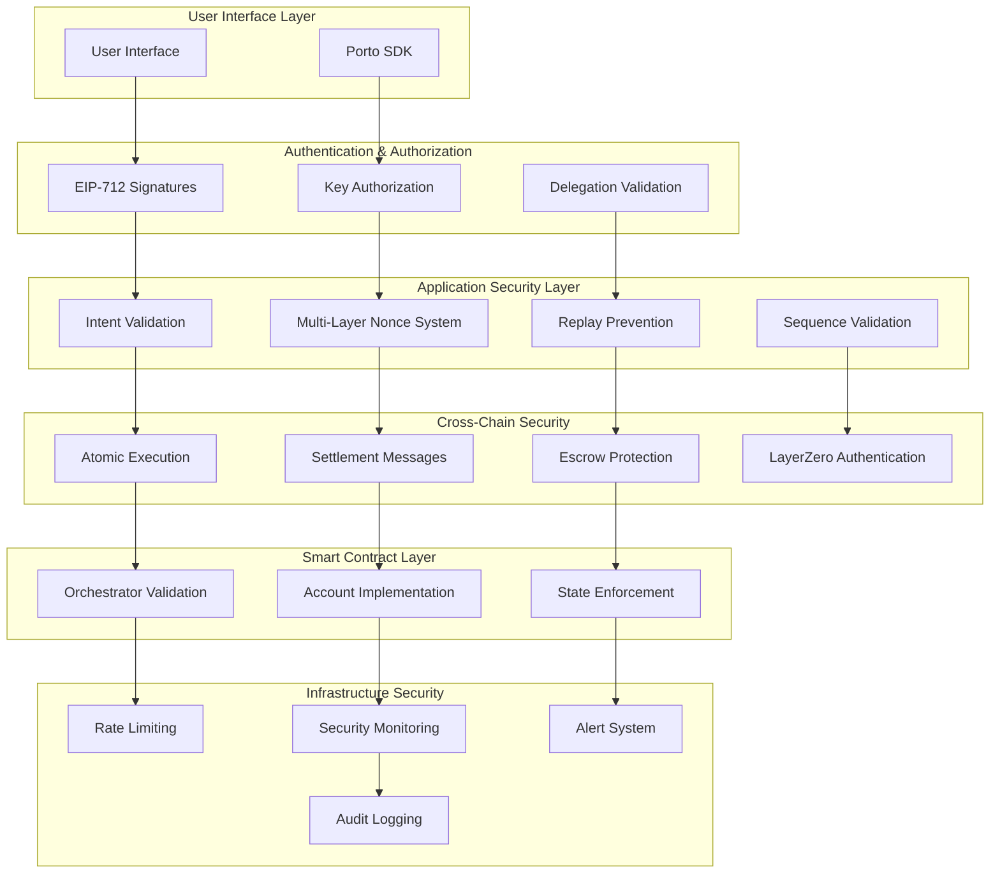
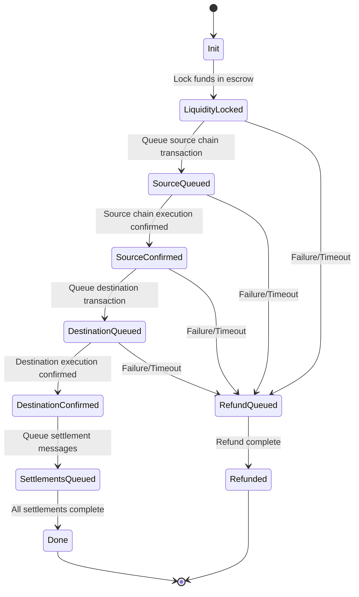

# Security Architecture Overview

The Ithaca Relay implements a comprehensive security model that protects user funds and prevents unauthorized operations across both single-chain and multichain contexts. This document provides an executive overview of the security architecture and serves as the entry point to detailed security documentation.

## Core Security Principles

### 1. Defense in Depth
The relay employs multiple overlapping security layers to ensure that if one mechanism fails, others continue to provide protection:

- **Application Layer**: Intent validation and nonce management
- **Cryptographic Layer**: EIP-712 signatures and key authorization
- **Smart Contract Layer**: On-chain validation and execution controls
- **Network Layer**: Cross-chain message authentication
- **Infrastructure Layer**: Rate limiting and monitoring

### 2. Zero Trust Architecture
Every component and interaction is verified regardless of source:

- **Intent Validation**: All intents undergo comprehensive validation
- **Signature Verification**: Every operation requires cryptographic proof
- **State Verification**: Cross-chain state is continuously validated
- **Message Authentication**: All cross-chain messages are authenticated

### 3. Fail-Safe Design
System failures default to secure states that protect user assets:

- **Automatic Refunds**: Failed operations trigger fund returns
- **Timeout Protection**: Operations have maximum execution times
- **State Recovery**: System can recover from inconsistent states
- **Graceful Degradation**: Partial failures don't compromise security

## Security Architecture Components



## Multi-Layer Nonce Protection System

The relay implements a sophisticated three-layer nonce system that prevents replay attacks while enabling flexible transaction ordering.

### Layer Overview

| Layer | Purpose | Implementation | Security Property |
|--------|---------|----------------|------------------|
| **Ethereum Nonces** | Blockchain transaction ordering | `MultiChainNonceManager` | Prevents transaction reordering |
| **Intent Nonces** | Application-level replay protection | 256-bit sequence system | Enables flexible ordering semantics |
| **Delegation Nonces** | EIP-7702 delegation management | Per-delegation counters | Isolates delegation contexts |

### 256-Bit Intent Nonce Structure

```
┌─────────────────────────────────────────────────────────────────────────────────┐
│                           256-bit Intent Nonce                                 │
├─────────────────────────────────────────────────────────────────────────────────┤
│ Bits 0-15      │ Bits 16-191        │ Bits 192-255                            │
│ Multichain     │ User Sequence      │ Sequential Nonce                        │
│ Flag (0xc1d0)  │ Identifier         │ (Within Sequence)                       │
└─────────────────────────────────────────────────────────────────────────────────┘
```

**Key Features**:
- **Multichain Support**: Special prefix enables cross-chain atomic operations
- **Flexible Ordering**: Independent sequences allow parallel execution
- **Replay Protection**: Each nonce can only be used once per EOA
- **Scalability**: 2^176 possible sequences per user

**📖 Detailed Documentation**: [Multi-Layered Nonce Protection](nonce-protection.md)

## Comprehensive Replay Attack Prevention

The relay implements multiple overlapping mechanisms to prevent various types of replay attacks:

### Attack Types and Mitigations

| Attack Type | Description | Primary Mitigation | Secondary Protection |
|-------------|-------------|-------------------|---------------------|
| **Simple Replay** | Retransmit valid intent | Intent nonce uniqueness | EIP-712 domain binding |
| **Cross-Chain Replay** | Replay intent on different chain | Chain ID in EIP-712 domain | Contract address binding |
| **Temporal Replay** | Replay old intents | Intent expiration timestamps | Market condition validation |
| **Sequence Manipulation** | Reorder intents within sequence | Sequential nonce enforcement | State consistency checks |
| **Cross-Sequence Replay** | Replay across different sequences | Sequence key isolation | Independent validation |

### Defense Mechanisms

#### 1. Intent Nonce System
- **Uniqueness Enforcement**: On-chain tracking prevents nonce reuse
- **Sequence Isolation**: Independent nonce spaces prevent cross-contamination
- **Atomic Consumption**: Nonces consumed atomically with execution

#### 2. EIP-712 Domain Separation
- **Chain Binding**: Signatures tied to specific chains for single-chain intents
- **Contract Binding**: Signatures bound to orchestrator contract address
- **Version Protection**: Domain versioning prevents cross-version replays

#### 3. Temporal Protection
- **Intent Expiration**: Built-in expiry timestamps prevent stale replays
- **Quote TTL**: Limited-time quotes prevent delayed execution
- **Market Validation**: Real-time condition checks at execution

**📖 Detailed Documentation**: [Comprehensive Replay Prevention](replay-prevention.md)

## Cross-Chain Security Guarantees

For multichain operations, the relay provides security guarantees equivalent to single-chain operations through atomic coordination mechanisms.

### Core Guarantees

#### 1. Atomic Execution
**Promise**: Either all chains in a multichain intent succeed, or all chains revert to their initial state.

**Implementation**: Bundle state machine with LayerZero settlement coordination.

#### 2. Fund Safety
**Promise**: User funds are never at risk during cross-chain operations.

**Implementation**: Escrow-based fund locking with timeout refunds.

#### 3. Consistency
**Promise**: All chains maintain consistent state regarding bundle execution.

**Implementation**: Coordinated state transitions with message authentication.

### Bundle State Machine



### LayerZero Security Integration

The relay leverages LayerZero's Decentralized Verifier Network (DVN) system for secure cross-chain messaging:

- **Multi-DVN Verification**: Multiple independent verifiers must agree
- **Message Authentication**: Cryptographic integrity protection
- **Execution Proofs**: Verifiable on-chain execution evidence
- **Timeout Protection**: Automatic refunds for failed settlements

**📖 Detailed Documentation**: [Cross-Chain Security Guarantees](cross-chain-security.md)

## Intent Nonce Specification

The 256-bit Intent nonce system enables sophisticated transaction ordering and replay protection through a carefully designed bit layout.

### Technical Specification

#### Bit Allocation
- **Bits 0-15**: Multichain flag (`0xc1d0` for cross-chain intents)
- **Bits 16-191**: User-defined sequence identifier (176 bits)
- **Bits 192-255**: Sequential nonce within sequence (64 bits)

#### Sequence Semantics
- **Within Sequence**: Strict monotonic ordering enforced
- **Between Sequences**: No ordering constraints (parallel execution)
- **Cross-Chain**: Shared nonce space for atomic multichain operations

#### PreCall Isolation
PreCalls (nested intents) use independent nonce validation for complex execution patterns while maintaining security.

**📖 Detailed Documentation**: [Intent Nonce Specification](intent-nonces.md)

## Threat Model and Risk Assessment

### In-Scope Threats

#### High Severity
- **Fund Theft**: Unauthorized access to user funds
- **Replay Attacks**: Unauthorized re-execution of operations
- **Cross-Chain Attacks**: Manipulation of multichain coordination
- **State Manipulation**: Corruption of system state

#### Medium Severity
- **Transaction Reordering**: MEV attacks and front-running
- **Denial of Service**: System availability attacks
- **Information Disclosure**: Unauthorized data access
- **Settlement Manipulation**: Cross-chain message tampering

#### Low Severity
- **Rate Limiting Bypass**: Quota system circumvention
- **Monitoring Evasion**: Detection system bypasses
- **Configuration Attacks**: System misconfiguration exploitation

### Risk Mitigation Matrix

| Risk Category | Probability | Impact | Mitigation Strategy | Residual Risk |
|---------------|-------------|--------|-------------------|---------------|
| Fund Theft | Low | Critical | Multi-layer validation + escrow | Very Low |
| Replay Attacks | Medium | High | Comprehensive nonce system | Very Low |
| Cross-Chain Attacks | Low | High | LayerZero security + atomic execution | Low |
| State Manipulation | Low | Medium | Event-based validation + recovery | Low |
| Transaction Reordering | High | Low | Intent-based execution | Low |


## Security Operations

### Monitoring and Alerting

#### Real-Time Monitoring
```rust
// Security metrics tracked continuously
counter!("security.replay_attempts.total").increment(1);
counter!("security.invalid_signatures.total").increment(1);
histogram!("security.validation_duration", validation_time);
gauge!("security.active_bundles", active_bundle_count);
```

## Security Documentation Index

### Core Security Documents

| Document | Focus Area | Target Audience |
|----------|------------|-----------------|
| **[Nonce Protection](nonce-protection.md)** | Multi-layer nonce system | Developers, Security Engineers |
| **[Replay Prevention](replay-prevention.md)** | Comprehensive replay protection | Security Engineers, Auditors |
| **[Intent Nonces](intent-nonces.md)** | 256-bit nonce specification | Protocol Developers |
| **[Cross-Chain Security](cross-chain-security.md)** | Multichain security guarantees | Cross-chain Developers |

### Implementation References

| Component | Security Relevance | Code Reference |
|-----------|-------------------|----------------|
| **MultiChainNonceManager** | Ethereum transaction nonces | `src/nonce.rs` |
| **Intent Validation** | Application-level security | `src/types/intent.rs` |
| **EIP-712 Signing** | Cryptographic authentication | `src/types/orchestrator.rs` |
| **LayerZero Settlement** | Cross-chain message security | `src/interop/settler/layerzero/` |
| **Bundle State Machine** | Cross-chain atomic execution | `src/interop/settler/processor.rs` |