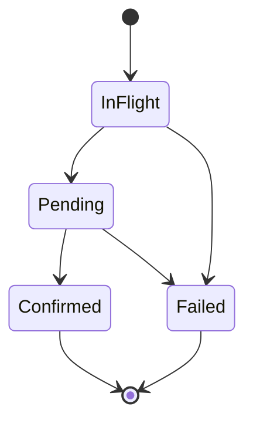
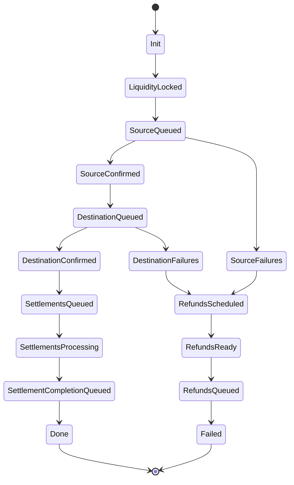

# Transaction Pipeline Architecture

This document details the complete transaction processing pipeline from intent submission to blockchain confirmation.

## Pipeline Overview

The transaction pipeline consists of five main stages that transform user intents into blockchain transactions:

1. **Intent Processing** (Steps 1-3): User creates intent, SDK validates and sends to relay
2. **Execution Planning** (Steps 4-6): Relay analyzes intent, fetches prices, and simulates execution
3. **Quote Generation** (Steps 7-8): Relay calculates fees and creates binding quote for user
4. **Transaction Execution** (Steps 9-12): User signs intent, relay submits to blockchain with monitoring
5. **Cross-Chain Settlement** (Steps 13-15): For multi-chain intents, settlement across destination chains

For complete technical details, see the [15-Step Data Flow](#detailed-15-step-data-flow) below.

## Detailed 15-Step Data Flow

The transaction pipeline consists of five main stages that transform user intents into blockchain transactions:

1. **Intent Processing** (Steps 1-3): User creates intent, SDK validates and sends to relay
2. **Execution Planning** (Steps 4-6): Relay analyzes intent, fetches prices, and simulates execution
3. **Quote Generation** (Steps 7-8): Relay calculates fees and creates binding quote for user
4. **Transaction Execution** (Steps 9-12): User signs intent, relay submits to blockchain with monitoring
5. **Cross-Chain Settlement** (Steps 13-15): For multi-chain intents, settlement across destination chains

### Step 1: Intent Creation (User/SDK)
You (or your app) define the intent in the Porto SDK as a JavaScript object (e.g., `{ calls: [...], feeToken: 'USDC' }`). The SDK validates basics (e.g., addresses) and serializes it into a JSON payload.

**Data**: High-level params → JSON object

### Step 2: SDK Sends Preparation Request to Relay
SDK makes a JSON-RPC call to the relay's `wallet_prepareCalls` endpoint (HTTP/WebSocket).

**Data**: JSON payload (intent params) → Relay RPC server  
**Trustless**: Relay can't execute yet

### Step 3: Relay Validates Request (**Implementation**: `src/rpc/relay.rs`)
Relay receives and validates the intent (e.g., supported chain/token, account delegation via EIP-7702). If invalid, returns error.

**Data**: JSON → Internal structs (e.g., `PrepareCallsParams` in Rust)

### Step 4: Relay Determines Execution Strategy (**Implementation**: `src/rpc/relay.rs`)
Relay analyzes if it's single- or multi-chain (e.g., check balances across chains for funding needs).

**Data**: Params → Strategy (e.g., funding plan if cross-chain)

### Step 5: Relay Fetches Prices from Oracles (**Implementation**: `src/price/oracle.rs`)
**Parallel**: Relay queries price oracles (CoinGecko) for token rates (e.g., USDC/ETH).

**Data**: API calls → Price data (e.g., `ethPrice: U256`)

### Step 6: Relay Simulates Execution (**Implementation**: `src/types/orchestrator.rs`)
Relay calls the off-chain Simulator Contract with state overrides (mock balances). Predicts gas, asset diffs (incoming/outgoing tokens), and outcomes.

**Data**: Encoded intent → Simulation results (e.g., `gasUsed`, `AssetDiffs`)

### Step 7: Relay Generates Quote (**Implementation**: `src/rpc/relay.rs`)
Combines simulation + prices into a signed quote (costs, TTL). Includes digest (EIP-712 hash) for signing.

**Data**: Results → Signed Quote object + digest

### Step 8: Relay Returns Quote to SDK
Relay sends back the quote, digest, typed data, and previews (e.g., asset diffs).

**Data**: Internal response → JSON RPC result

### Step 9: SDK Prompts User for Signature
SDK displays quote/preview and requests signature (e.g., via wallet like MetaMask). User signs the EIP-712 digest.

**Data**: Digest → Signature (e.g., Hex string)  
**Trustless**: Signature binds relay to exact intent

### Step 10: SDK Submits Signed Intent to Relay (**Implementation**: `src/rpc/relay.rs`)
SDK sends the signed prepared intent via `wallet_sendPreparedCalls`.

**Data**: Signature + context → JSON RPC payload

### Step 11: Relay Verifies Signature and Quote (**Implementation**: `src/rpc/relay.rs`)
Relay checks signature validity, quote expiration, and nonce.

**Data**: Payload → Verified intent

### Step 12: Relay Builds and Broadcasts Transaction (**Implementation**: `src/transactions/signer.rs`)
Relay constructs the on-chain transaction (e.g., calls Orchestrator Contract) and broadcasts to the blockchain. For multi-chain: Locks funds in Escrow, sends LayerZero messages.

**Data**: Verified intent → Raw transaction (e.g., with gas sponsored by relay)

### Step 13: Blockchain/Contracts Execute
Orchestrator validates (nonce, sig, permissions), processes payments, executes calls atomically. Emits events (e.g., `IntentExecuted`). For cross-chain: LayerZero verifies messages; Escrow releases/refunds funds.

**Data**: Tx → Receipt + logs

### Step 14: Relay Monitors Execution (**Implementation**: `src/transactions/monitor.rs`)
Relay polls blockchain for status (pending → confirmed/failed) and updates internal storage (e.g., PostgreSQL).

**Data**: Tx hash → Status updates

### Step 15: SDK/User Monitors Status (**Implementation**: `src/rpc/relay.rs`)
You poll via `wallet_getCallsStatus` (or SDK hooks).

**Data**: Bundle ID → Final status (e.g., receipt, block number)

## Pipeline Architecture

```mermaid
graph LR
    subgraph "Input Stage"
        INT[Intent Submission]
        VAL[Validation]
    end
    
    subgraph "Processing Stage"  
        QUEUE[Transaction Queue]
        SIGN[Signing Service]
        BROAD[Broadcasting]
    end
    
    subgraph "Monitoring Stage"
        MON[Status Monitoring]
        UPD[Database Updates]
        NOTIF[Status Notifications]
    end
    
    subgraph "Completion Stage"
        CONF[Confirmation]
        FINAL[Finalization]
    end
    
    INT --> VAL
    VAL --> QUEUE
    QUEUE --> SIGN
    SIGN --> BROAD
    BROAD --> MON
    MON --> UPD
    UPD --> NOTIF
    NOTIF --> CONF
    CONF --> FINAL
```



## Stage 1: Intent Validation and Routing

### Intent Classification

**Implementation**: `src/rpc/relay.rs`

When a signed intent arrives via `wallet_sendPreparedCalls`, the relay classifies the execution type:

```rust
// Route to appropriate execution path
if quotes.ty().multi_chain_root.is_none() {
    self.send_single_chain_intent(&quotes, capabilities, signature, bundle_id).await
} else {
    self.send_multichain_intents(quotes, capabilities, signature, bundle_id).await
}
```

**Classification criteria**:
- **Single-chain**: All operations on one blockchain
- **Multi-chain**: Requires cross-chain coordination and settlement

### Validation Steps

**Quote verification** (**Implementation**: `src/rpc/relay.rs`):
1. **Expiration check**: Ensure quote hasn't expired
2. **Signature verification**: Validate relay's quote signature  
3. **User signature assembly**: Build complete signature payload

**Bundle creation** (**Implementation**: `src/rpc/relay.rs`):
- Generate deterministic `BundleId` from quote hash
- Create bundle tracking entry in database
- Initialize transaction status monitoring

## Stage 2: Transaction Service Processing

### Queue Management

**Transaction queuing** (**Implementation**: `src/transactions/service.rs`):

The transaction service maintains per-EOA ordered queues to ensure nonce consistency:

```rust
pub async fn send_transaction(
    &self,
    transaction: TransactionRequest,
    bundle: Option<BundleId>,
    chain_id: ChainId,
    signer_preference: SignerPreference,
) -> Result<(), TransactionServiceError> {
    self.queue_transaction(transaction, bundle, chain_id, signer_preference).await
}
```

**Queue characteristics**:
- **Per-EOA ordering**: Maintains nonce sequence per account
- **Capacity limits**: Prevents queue overflow  
- **Priority handling**: Supports transaction prioritization
- **Deadlock prevention**: Timeout mechanisms for stalled transactions

### Signer Selection

**Signer management** (**Implementation**: `src/transactions/service.rs`):
- **Load balancing**: Distribute transactions across available signers
- **Health monitoring**: Pause signers with low balance or errors
- **Preference handling**: Route to preferred signers when possible

## Stage 3: Transaction Signing and Broadcasting

### Signing Process

**Transaction signing** (**Implementation**: `src/transactions/signer.rs`):

```rust
async fn sign_transaction(
    &self,
    provider: &DynProvider,
    wallet: &NetworkWallet,  
    mut transaction: TransactionRequest,
) -> Result<B256, SignerError> {
    // Sign the transaction
    let signed = wallet.sign_transaction_from(&mut transaction).await?;
    
    // Broadcast to network
    let hash = provider.send_raw_transaction(&signed.encoded_2718()).await?;
    
    Ok(hash)
}
```

**Signing pipeline**:
1. **Transaction preparation**: Set gas, nonce, and fee parameters
2. **Cryptographic signing**: Sign with relay's private key
3. **Network broadcasting**: Submit to blockchain network
4. **Hash tracking**: Store transaction hash for monitoring

### Validation Before Signing

**Pre-flight validation** (**Implementation**: `src/transactions/signer.rs`):
- **Gas estimation**: Simulate transaction to estimate gas usage
- **Balance checking**: Ensure signer has sufficient funds
- **Nonce verification**: Confirm nonce is correct and sequential

### Broadcasting Strategy

**Network submission** (**Implementation**: `src/transactions/signer.rs`):
- **Provider selection**: Choose optimal RPC endpoint
- **Retry logic**: Handle temporary network failures
- **Fee escalation**: Increase gas price for stuck transactions

## Stage 4: Transaction Monitoring

### Status Tracking

**Transaction monitoring** (**Implementation**: `src/transactions/monitor.rs`):

```rust
pub async fn watch_transaction(
    &self,
    tx_hash: B256,
    timeout: Option<Duration>,
) -> Result<TransactionReceipt, TransactionMonitoringError> {
    let config = PendingTransactionConfig::new()
        .with_timeout(timeout.unwrap_or(self.default_timeout))
        .with_block_range(self.block_range);

    let receipt = self.provider
        .watch_pending_transaction(config.clone())
        .get_receipt(tx_hash)
        .await?;

    Ok(receipt)
}
```

**Monitoring features**:
- **Multi-provider watching**: Monitor via multiple RPC endpoints for faster detection
- **Configurable timeouts**: Handle network congestion gracefully
- **Block confirmation tracking**: Wait for specified confirmation depth

### Status State Machine

**Transaction states** (**Implementation**: `src/transactions/transaction.rs`):



**State descriptions**:
- **InFlight**: Transaction being prepared and broadcast
- **Pending**: Submitted to mempool, waiting for confirmation
- **Confirmed**: Included in block and confirmed
- **Failed**: Broadcast failed or transaction reverted

### Database Integration

**Status persistence** (**Implementation**: `src/storage/pg.rs`):
- **Atomic updates**: Transaction status changes are atomic
- **Historical tracking**: Maintain complete transaction history
- **Query optimization**: Indexed queries for status lookup

## Stage 5: Bundle Management (Multi-Chain)

### Cross-Chain Coordination

**Bundle state machine** (**Implementation**: `src/transactions/interop.rs`):

For multi-chain intents, the relay coordinates complex state transitions:



**State management** (**Implementation**: `src/transactions/interop.rs`):
- **Atomic transitions**: State changes are validated and atomic
- **Recovery mechanisms**: Handle failed cross-chain operations
- **Timeout handling**: Automatic refunds for stalled operations

### Settlement Processing

**LayerZero integration** (**Implementation**: `src/interop/settler/layerzero/processor.rs`):
- **Message verification**: Validate cross-chain messages
- **Settlement execution**: Process settlement transactions
- **State synchronization**: Keep settlement state consistent

## Error Handling and Recovery

### Error Classification

**Error types** (**Implementation**: `src/error/mod.rs`):

| Error Category | Example | Recovery Strategy |
|----------------|---------|-------------------|
| **Validation errors** | Invalid nonce | Reject transaction |
| **Network errors** | RPC timeout | Retry with backoff |
| **Signing errors** | Insufficient balance | Pause signer |
| **Confirmation errors** | Transaction reverted | Mark as failed |

### Recovery Mechanisms

**Automatic recovery** (**Implementation**: `src/transactions/signer.rs`):
- **Nonce gap closure**: Detect and fill nonce gaps
- **Fee escalation**: Increase gas price for stuck transactions
- **Signer rotation**: Switch to healthy signers on errors

**Manual intervention**:
- **Transaction replacement**: Replace stuck transactions
- **Bundle recovery**: Restart failed cross-chain bundles
- **Database consistency**: Repair inconsistent state

## Performance Optimization

### Throughput Optimization

**Concurrent processing** (**Implementation**: `src/transactions/service.rs`):
- **Parallel execution**: Process multiple transactions simultaneously
- **Queue partitioning**: Separate queues per chain and signer
- **Batch operations**: Group database operations for efficiency

### Latency Optimization

**Fast confirmation detection**:
- **Multiple providers**: Query multiple RPC endpoints in parallel
- **WebSocket subscriptions**: Real-time transaction status updates
- **Optimistic confirmations**: Report status on first confirmation

### Resource Management

**Connection pooling** (**Implementation**: `src/provider.rs`):
- **Database connections**: SQLx connection pooling
- **RPC connections**: HTTP/WebSocket connection reuse
- **Memory management**: Efficient data structures and cleanup

## Monitoring and Metrics

### Pipeline Metrics

**Key performance indicators** (**Implementation**: `src/metrics/transport.rs`):
- **Transaction throughput**: Transactions per second
- **Confirmation latency**: Time from submission to confirmation
- **Error rates**: Failed transaction percentages
- **Queue depths**: Pending transaction counts

### Alerting

**Critical alerts**:
- **High error rates**: Excessive transaction failures
- **Signer health**: Low balance or connection issues
- **Queue overflow**: Transaction queue capacity limits
- **Confirmation delays**: Unusually slow confirmations

### Observability

**Tracing integration** (**Implementation**: `src/otlp.rs`):
- **Request correlation**: Track transactions end-to-end
- **Performance profiling**: Identify bottlenecks
- **Error context**: Detailed error information

## Configuration

### Pipeline Configuration

For complete configuration details including transaction service and monitoring parameters, see [Getting Started Configuration Guide](../development/getting-started.md#configuration).

### Chain-Specific Settings

**Per-chain configuration**:
- **Gas price strategies**: EIP-1559 vs legacy pricing
- **Confirmation requirements**: Different security levels
- **Provider endpoints**: Multiple RPC endpoints per chain
- **Settlement contracts**: Cross-chain coordination addresses

---

## Related Documentation

- **[System Overview](overview.md)** - High-level architecture
- **[RPC Endpoints](rpc-endpoints.md)** - API implementation details
- **[Cross-Chain Operations](cross-chain.md)** - Multi-chain coordination
- **[Storage Layer](storage-layer.md)** - Database schema and operations

---

💡 **Development Tip**: Use the bundle state machine diagram (`docs/diagrams/bundle_state_machine.svg`) to understand cross-chain transaction coordination and state transitions.